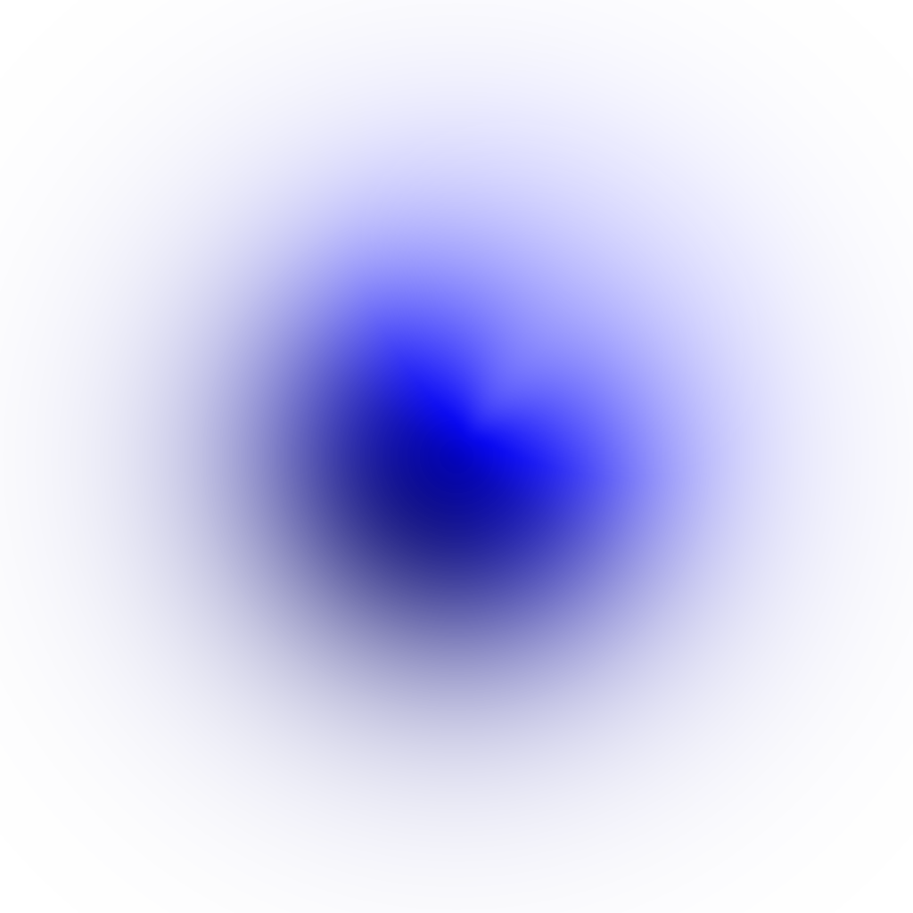
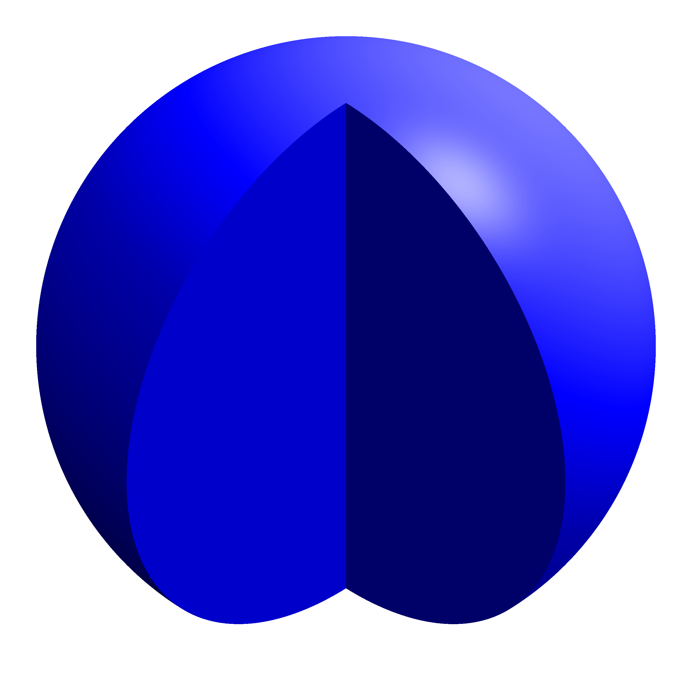
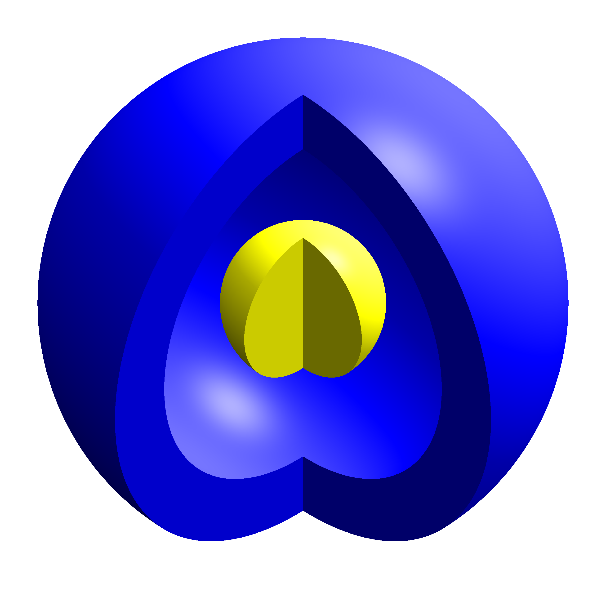
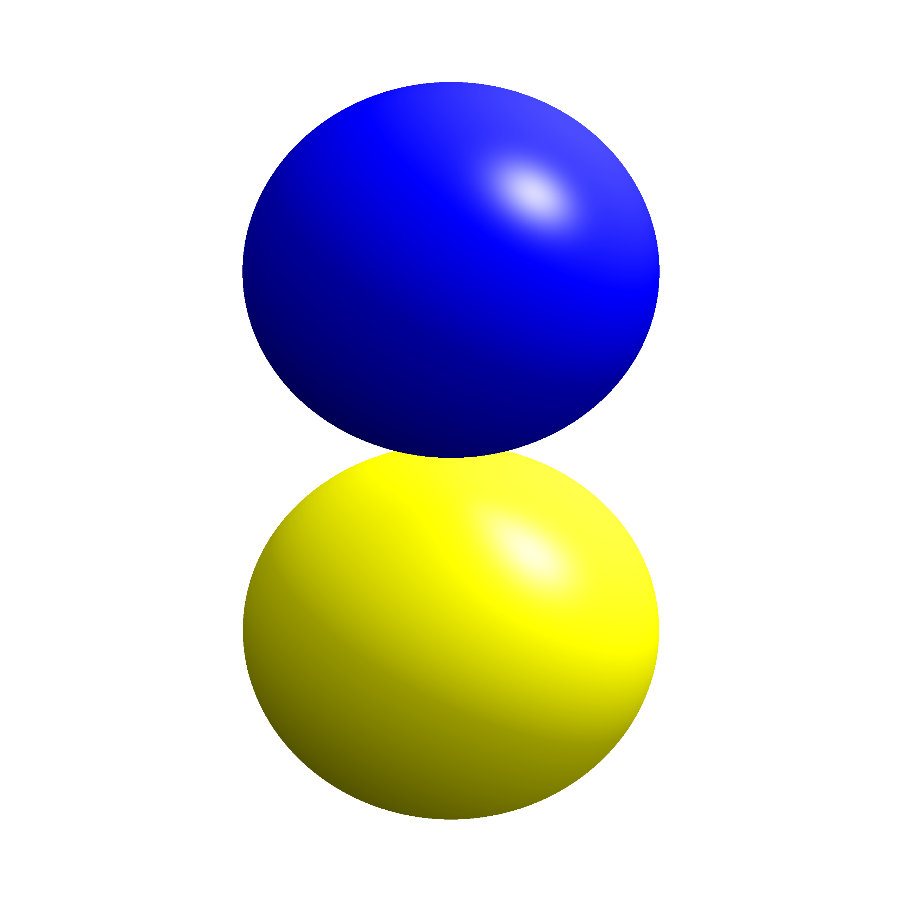
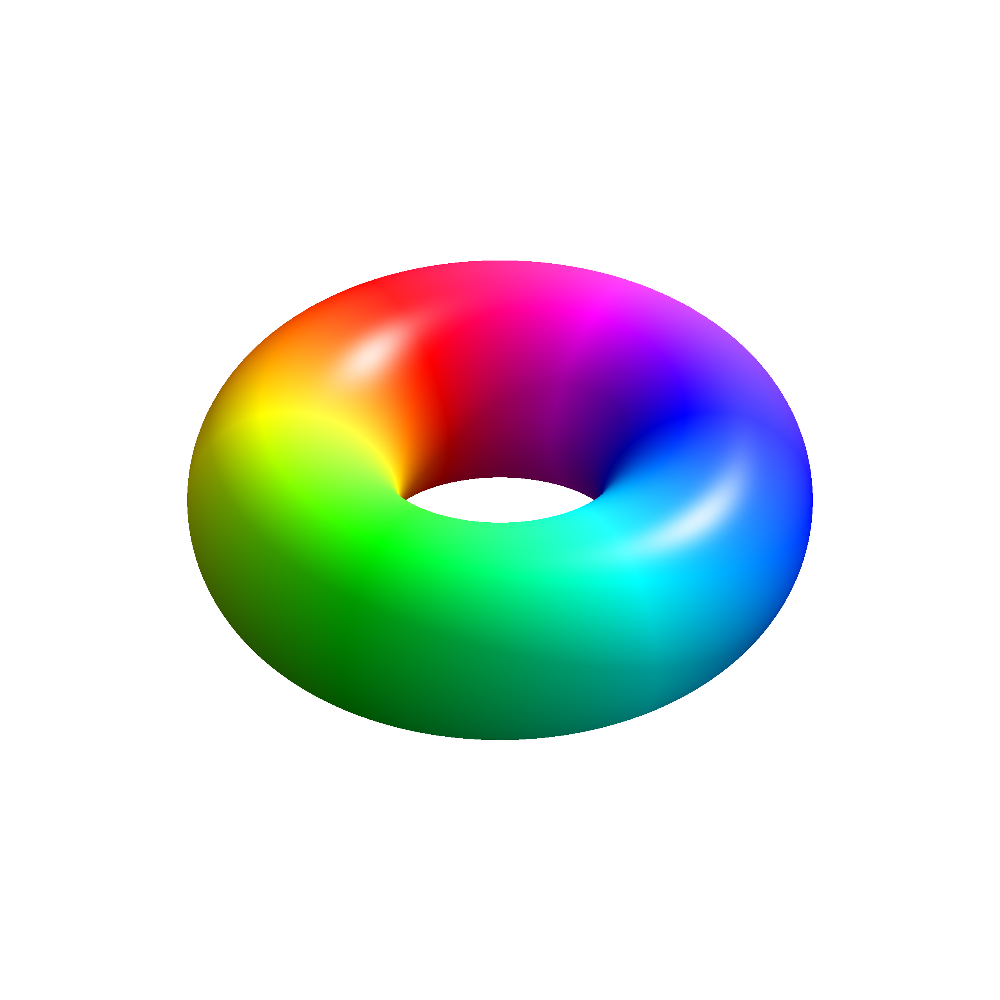
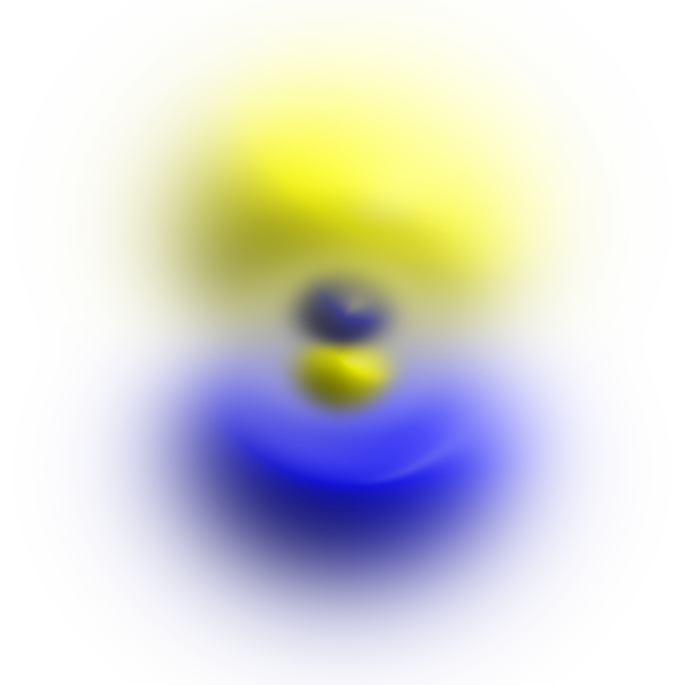
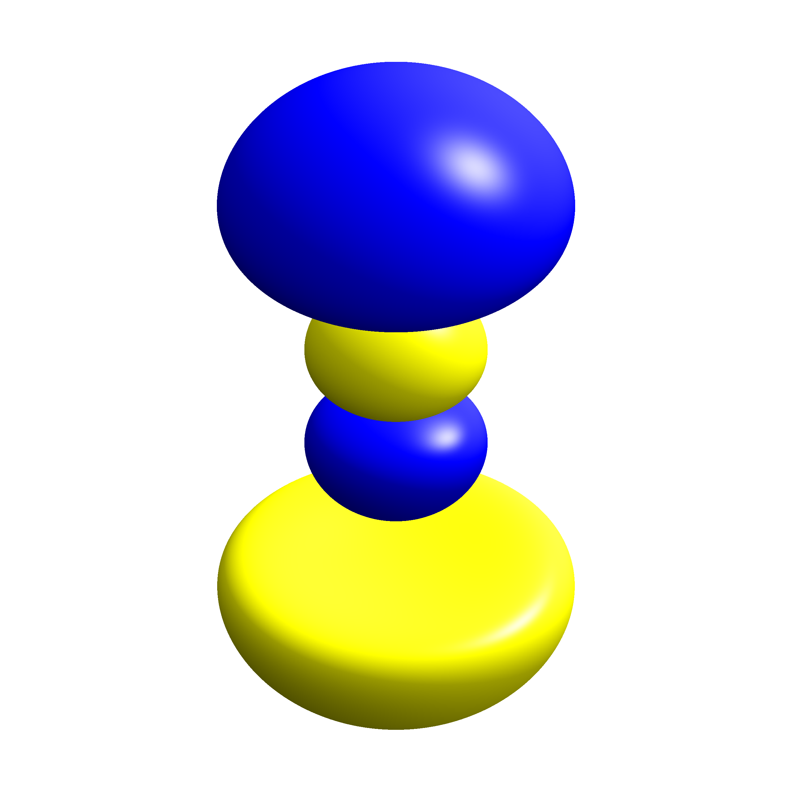
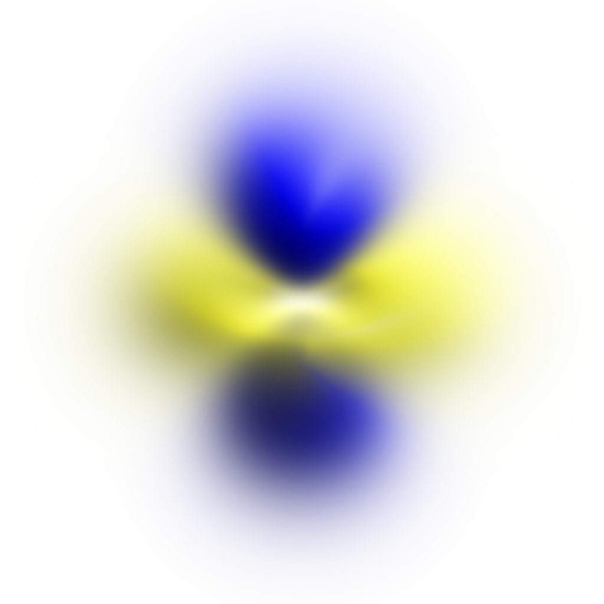
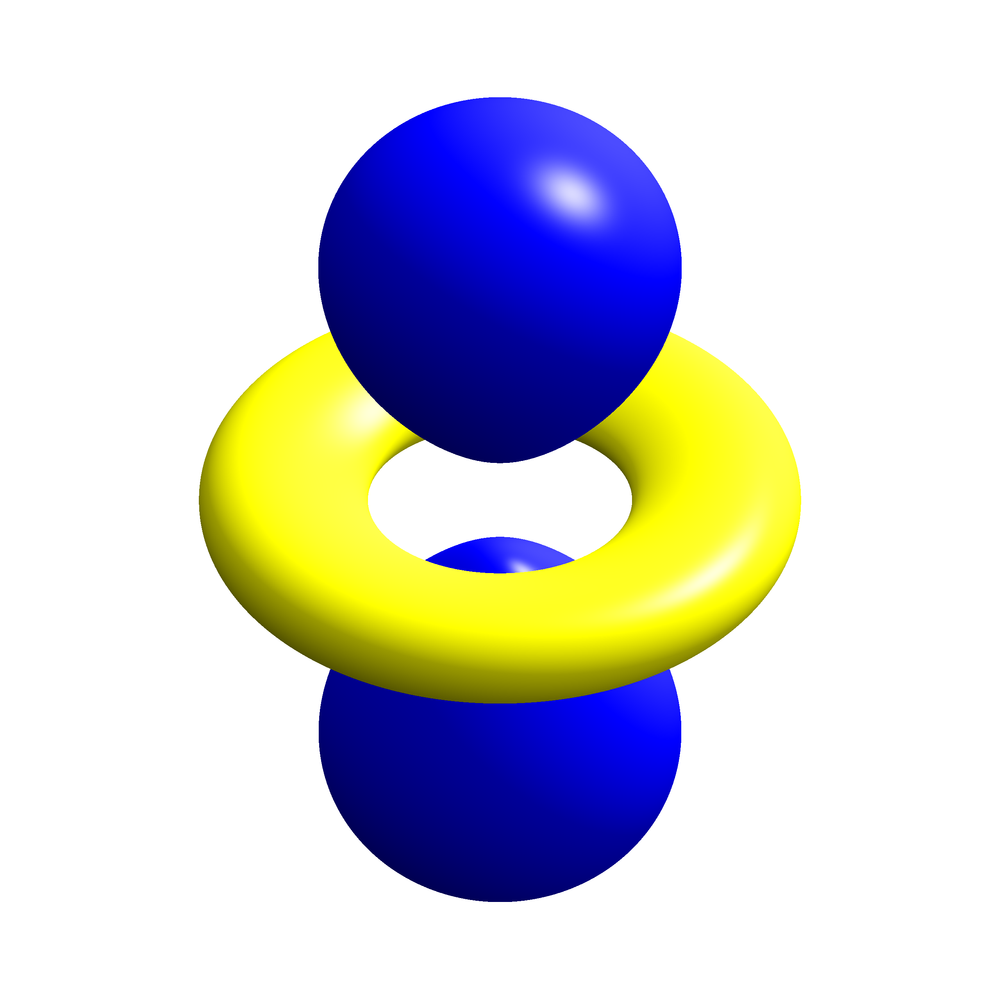

# Overview

In the previous chapters, we treated the two parts of the hydrogen wavefunction separately:

$$
\psi_{n\ell m}(r,\theta,\varphi)
=
R_{n\ell}(r)\,
Y_\ell^m(\theta,\varphi).
$$

The angular functions $Y_\ell^m(\theta,\varphi)$ and their shapes were discussed in [Orbital Angular Momentum](angmom.qmd), while the radial functions $R_{n\ell}(r)$ and the corresponding radial probability distributions were discussed in [The Hydrogen Atom](hydrogen.qmd).

Here we put these two pieces together and visualize the **complete three-dimensional hydrogen wavefunctions**.

The purpose of this page is not to derive new wavefunctions. Instead, we will use the solutions obtained previously to understand

- what an orbital picture actually represents;
- how radial and angular structure combine in three dimensions;
- how nodes appear in the complete wavefunction;
- how the quantum numbers $n$, $\ell$, and $m$ affect the spatial structure;
- why the $m$ eigenstates used in atomic physics do not always look like the familiar real-valued orbitals used in chemistry.

---

# 1. What Does an Orbital Picture Show?

A hydrogen orbital is the spatial wavefunction

$$
\psi_{n\ell m}(\vec r),
$$

not a trajectory followed by the electron and not a solid object with a sharp boundary.

The probability of detecting the electron in a small volume $d^3r$ around the position $\vec r$ is

$$
dP
=
|\psi_{n\ell m}(\vec r)|^2\,d^3r.
$$

Thus the physically measurable spatial distribution is determined by the **probability density**

$$
|\psi_{n\ell m}(\vec r)|^2.
$$

The figures on this page can be viewed in two complementary representations:

- The **probability-cloud representation** shows the continuous spatial distribution of $|\psi|^2$. Regions in which the cloud is more prominent correspond to larger probability density, and the cloud fades continuously rather than ending at a sharply defined boundary.
- The **isodensity representation** shows a surface on which $|\psi|^2$ has a chosen constant value. This gives a clearer impression of the three-dimensional geometry. For the $s$ orbitals shown below, a wedge is cut from the surface to reveal the internal radial structure.

Use the tabs above each figure to switch between the two representations of the same quantum state.

In both representations, **color** contains additional information: it represents the phase of the wavefunction $\psi$. For wavefunctions that can be chosen real, this mainly distinguishes regions in which the wavefunction has opposite signs. For complex $m\neq0$ eigenstates, the phase varies continuously with the azimuthal angle.

:::: {.callout-important title="Orbital pictures are representations"}

An orbital image should therefore not be interpreted as a picture of the electron itself.

It is a graphical representation of the spatial wavefunction and its probability density. Different visualization methods---cloud plots, cross sections, isosurfaces, or phase-colored surfaces---can represent the **same quantum state** in different ways.

::::

The figures below are not displayed on a common spatial scale. Their purpose is to compare the **structure** of the orbitals; the apparent size of one image relative to another should not be used as a quantitative comparison of orbital radii.

---

# 2. Putting the Radial and Angular Parts Together

For hydrogen,

$$
\psi_{n\ell m}(r,\theta,\varphi)
=
R_{n\ell}(r)
Y_\ell^m(\theta,\varphi).
$$

Taking the absolute square gives

$$
\boxed{
|\psi_{n\ell m}(r,\theta,\varphi)|^2
=
|R_{n\ell}(r)|^2
\,
|Y_\ell^m(\theta,\varphi)|^2.
}
$$

This makes the roles of the two factors especially clear:

- $R_{n\ell}(r)$ determines how the wavefunction changes with **distance from the nucleus**;
- $Y_\ell^m(\theta,\varphi)$ determines how it changes with **direction**.

The complete orbital is obtained by combining both structures.

This is the main point of the visualizations below: the angular patterns studied in [Orbital Angular Momentum](angmom.qmd) acquire the radial structure derived in [The Hydrogen Atom](hydrogen.qmd).

---

# 3. Nodes of the Full Wavefunction

A **node** is a region where the wavefunction vanishes,

$$
\psi_{n\ell m}(\vec r)=0.
$$

Because the hydrogen wavefunction separates into radial and angular parts, zeros can arise from either factor.

## 3.1 Radial Nodes

A radial node occurs when

$$
R_{n\ell}(r)=0
$$

at some nonzero radius.

For hydrogen, the number of radial nodes is

$$
\boxed{
N_{\mathrm{radial}}
=
n-\ell-1.
}
$$

In three dimensions, a radial node forms a **spherical nodal surface** around the nucleus.

For example,

- the $1s$ state has no radial nodes;
- the $2s$ state has one radial node;
- the $3p$ states have one radial node;
- the $3d$ states have no radial nodes.

## 3.2 Angular Nodes

Angular zeros are determined by the spherical harmonic,

$$
Y_\ell^m(\theta,\varphi)=0.
$$

Their geometry depends on $\ell$ and $m$ and was already visible in the angular distributions discussed in [Orbital Angular Momentum](angmom.qmd).

In the complete orbital, these angular zeros extend through the radial probability distribution and become nodal planes, cones, axes, or other nodal structures depending on the state.

The following examples show how radial and angular nodes appear together.

---

# 4. From $1s$ to $2s$: Purely Radial Structure

For an $s$ state,

$$
\ell=0,
\qquad
m=0,
$$

and the spherical harmonic is independent of direction. The complete probability density is therefore spherically symmetric.

:::: {layout-ncol=2}

::: {.panel-tabset}

### Probability cloud

{fig-alt="Three-dimensional probability cloud for the hydrogen 1s orbital. The cloud is spherically symmetric and concentrated around the nucleus."}

### Isodensity surface

{fig-alt="Wedge-cut isodensity representation of the hydrogen 1s orbital. A section is removed to show the interior of the spherically symmetric probability distribution."}

:::

::: {.panel-tabset}

### Probability cloud

{fig-alt="Three-dimensional probability cloud for the hydrogen 2s orbital. The orbital is spherically symmetric and contains an inner and outer region separated by a spherical radial node."}

### Isodensity surface

{fig-alt="Wedge-cut isodensity representation of the hydrogen 2s orbital. The removed section reveals the inner and outer regions separated by the spherical radial node."}

:::

::::

The $1s$ state has no nodes. Its probability density simply decreases with increasing distance from the nucleus.

For the $2s$ state,

$$
N_{\mathrm{radial}}
=
2-0-1
=
1.
$$

The zero of $R_{20}(r)$ therefore becomes a **spherical nodal surface** in the full three-dimensional orbital. The regions on the two sides of this node have opposite wavefunction phase, which is visible through the change in color.

This is the three-dimensional counterpart of the radial node already visible in the radial wavefunction $R_{20}(r)$.

---

# 5. The $2p$ States: The Role of $m$

For $\ell=1$, the angular part is no longer spherically symmetric.

The $2p$ states have

$$
n=2,
\qquad
\ell=1,
$$

and therefore

$$
N_{\mathrm{radial}}
=
2-1-1
=
0.
$$

Their structure is consequently determined primarily by the angular wavefunction.

Two examples are particularly instructive.

:::: {layout-ncol=2}

::: {.panel-tabset}

### Probability cloud

{fig-alt="Three-dimensional probability cloud for the hydrogen 2p state with m equals zero. The probability density forms two lobes along the z axis separated by a nodal plane in the xy plane."}

### Isodensity surface

{fig-alt="Isodensity-surface representation of the hydrogen 2p state with m equals zero. Two lobes extend along the z axis and are separated by the nodal plane in the xy plane."}

:::

::: {.panel-tabset}

### Probability cloud

{fig-alt="Three-dimensional probability cloud for the hydrogen 2p state with m equals one. The probability density is concentrated around the equatorial region and is rotationally symmetric around the z axis, while the color varies with azimuthal phase."}

### Isodensity surface

{fig-alt="Isodensity-surface representation of the hydrogen 2p state with m equals one. The probability density forms a toroidal region around the z axis, while color shows the changing azimuthal phase."}

:::

::::

For $m=0$,

$$
Y_1^0
\propto
\cos\theta,
$$

so the wavefunction vanishes in the plane $\theta=\pi/2$. This produces the familiar two-lobed probability distribution aligned with the $z$-axis.

For $m=1$,

$$
Y_1^1
\propto
\sin\theta\,e^{i\varphi}.
$$

The probability density is

$$
|Y_1^1|^2
\propto
\sin^2\theta,
$$

which is independent of $\varphi$. The **probability density is therefore rotationally symmetric around the $z$-axis**, even though the phase of the wavefunction changes continuously with $\varphi$.

This distinction between probability density and phase is difficult to see in a plot of $|\psi|^2$ alone, but it becomes visible in the phase-colored orbital image.

The $m=-1$ state has the same probability density as the $m=1$ state, but the phase winds in the opposite direction.

---

# 6. Combining Radial and Angular Structure

For higher states, radial and angular structure can appear simultaneously.

Consider the $3p$ state with $m=0$.

Its radial node count is

$$
N_{\mathrm{radial}}
=
3-1-1
=
1,
$$

while its angular dependence is still given by $Y_1^0$.

::: {.panel-tabset}

### Probability cloud

{fig-alt="Three-dimensional probability cloud for the hydrogen 3p state with m equals zero. The orbital has p-like angular structure along the z axis together with an additional radial node that separates inner and outer regions."}

### Isodensity surface

{fig-alt="Isodensity-surface representation of the hydrogen 3p state with m equals zero. The p-like angular structure and separated inner and outer regions reflect the angular and radial nodes."}

:::

The complete orbital therefore combines

- the $p$-type angular structure, including the angular node at the equatorial plane;
- one spherical radial node.

The resulting three-dimensional structure is considerably richer than either the radial function or the spherical harmonic viewed separately.

For comparison, the $3d$ state with $m=0$ has

$$
n=3,
\qquad
\ell=2,
\qquad
m=0,
$$

and therefore

$$
N_{\mathrm{radial}}
=
3-2-1
=
0.
$$

::: {.panel-tabset}

### Probability cloud

{fig-alt="Three-dimensional probability cloud for the hydrogen 3d state with m equals zero. The density has two lobes along the z axis together with an equatorial ring and angular nodal surfaces, but no radial node."}

### Isodensity surface

{fig-alt="Isodensity-surface representation of the hydrogen 3d state with m equals zero. Two lobes lie along the z axis with an equatorial ring, revealing the angular structure of the state."}

:::

Here there are no radial nodes. The complicated structure instead comes from the angular function $Y_2^0$.

These examples illustrate an important point: an orbital shape is not determined by a single quantum number. The complete spatial structure results from the combination of $n$, $\ell$, and $m$.

---

# 7. Why Do These Orbitals Look Different from $p_x$, $p_y$, and $d_{xy}$?

The hydrogen eigenstates used throughout this chapter were chosen to be simultaneous eigenstates of

$$
\hat H,
\qquad
\hat L^2,
\qquad
\hat L_z.
$$

They are therefore labeled by

$$
|n,\ell,m\rangle
$$

and their angular parts are the spherical harmonics $Y_\ell^m$.

For $m\neq0$, the spherical harmonics are generally **complex**. This is why, for example, the $m=1$ $p$ orbital shown above does not look like the familiar real-valued $p_x$ or $p_y$ orbital from chemistry.

:::: {.callout-note collapse="true" title="Real orbitals as superpositions of $m$ eigenstates"}

The familiar real-valued orbitals can be constructed as linear combinations of states with opposite values of $m$.

For $\ell=1$, for example,

$$
p_x
\propto
\frac{1}{\sqrt{2}}
\left(
Y_1^{-1}
-
Y_1^{1}
\right),
$$

and

$$
p_y
\propto
\frac{i}{\sqrt{2}}
\left(
Y_1^{-1}
+
Y_1^{1}
\right).
$$

These combinations are real functions apart from an overall phase and produce the familiar lobes oriented along the $x$- and $y$-axes.

They are perfectly valid hydrogen states because the states with different $m$ values are degenerate in the absence of external fields. However, $p_x$ and $p_y$ are **not eigenstates of $\hat L_z$**.

For problems in which the $z$-component of angular momentum is important---for example in the presence of a magnetic field defining a quantization axis---the complex $m$ eigenstates are usually the more natural basis.

::::

---

# 8. Reading an Orbital Image

When looking at a hydrogen orbital visualization, it is useful to ask several separate questions:

1. **What is being plotted?**  
   In the probability-cloud view, the cloud represents the continuous spatial distribution of $|\psi|^2$. In the isodensity view, the surface marks a chosen constant value of $|\psi|^2$. In both representations, color represents the phase of $\psi$.

2. **What radial structure is present?**  
   Radial nodes come from zeros of $R_{n\ell}(r)$ and appear as spherical nodal surfaces.

3. **What angular structure is present?**  
   Angular zeros and directional structure come from $Y_\ell^m(\theta,\varphi)$.

4. **What does the color mean?**  
   It represents phase, not additional probability density or electric charge.

5. **Is the picture a boundary of the orbital?**  
   No. Even when an isodensity surface is shown, that surface is only a chosen visualization threshold. The hydrogen wavefunction extends throughout space and decreases continuously at large distances.

The orbital is therefore best understood not as a geometric object by itself, but as a visualization of the complete hydrogen wavefunction

$$
\boxed{
\psi_{n\ell m}
=
R_{n\ell}
Y_\ell^m.
}
$$

The three-dimensional pictures on this page are the direct visual consequence of the radial and angular solutions derived in the preceding chapters.

---

# Image Credits

All orbital images on this page were created by **Geek3** and are hosted locally on this site for reliable display. The original files are available from **Wikimedia Commons**.

The **probability-cloud images** are licensed under the [Creative Commons Attribution-ShareAlike 4.0 International license](https://creativecommons.org/licenses/by-sa/4.0/):

- [Atomic-orbital-cloud n1 l0 m0](https://commons.wikimedia.org/wiki/File:Atomic-orbital-cloud_n1_l0_m0.png)
- [Atomic-orbital-cloud n2 l0 m0](https://commons.wikimedia.org/wiki/File:Atomic-orbital-cloud_n2_l0_m0.png)
- [Atomic-orbital-cloud n2 l1 m0](https://commons.wikimedia.org/wiki/File:Atomic-orbital-cloud_n2_l1_m0.png)
- [Atomic-orbital-cloud n2 l1 m1](https://commons.wikimedia.org/wiki/File:Atomic-orbital-cloud_n2_l1_m1.png)
- [Atomic-orbital-cloud n3 l1 m0](https://commons.wikimedia.org/wiki/File:Atomic-orbital-cloud_n3_l1_m0.png)
- [Atomic-orbital-cloud n3 l2 m0](https://commons.wikimedia.org/wiki/File:Atomic-orbital-cloud_n3_l2_m0.png)

The **wedge-cut $1s$ and $2s$ isodensity images** are also licensed under CC BY-SA 4.0:

- [Hydrogen eigenstate n1 l0 m0 wedgecut](https://commons.wikimedia.org/wiki/File:Hydrogen_eigenstate_n1_l0_m0_wedgecut.png)
- [Hydrogen eigenstate n2 l0 m0 wedgecut](https://commons.wikimedia.org/wiki/File:Hydrogen_eigenstate_n2_l0_m0_wedgecut.png)

The remaining **isodensity-surface images** are earlier works from the same author and are licensed under the [Creative Commons Attribution-ShareAlike 3.0 Unported license](https://creativecommons.org/licenses/by-sa/3.0/):

- [Hydrogen eigenstate n2 l1 m0](https://commons.wikimedia.org/wiki/File:Hydrogen_eigenstate_n2_l1_m0.png)
- [Hydrogen eigenstate n2 l1 m1](https://commons.wikimedia.org/wiki/File:Hydrogen_eigenstate_n2_l1_m1.png)
- [Hydrogen eigenstate n3 l1 m0](https://commons.wikimedia.org/wiki/File:Hydrogen_eigenstate_n3_l1_m0.png)
- [Hydrogen eigenstate n3 l2 m0](https://commons.wikimedia.org/wiki/File:Hydrogen_eigenstate_n3_l2_m0.png)

The images are otherwise unmodified.