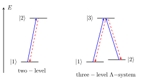
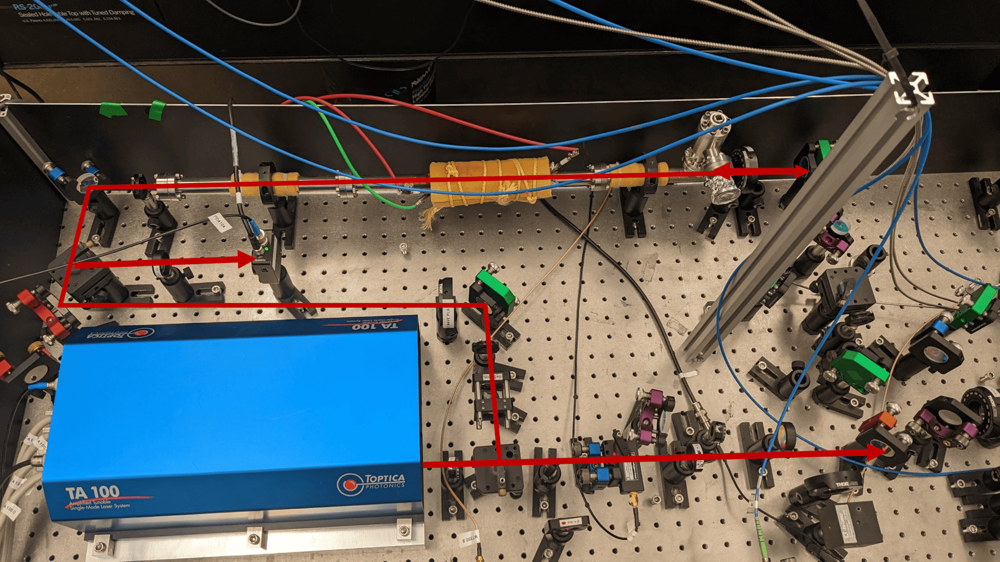
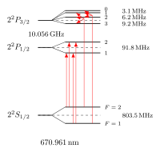

# Introduction

On the [previous page](spectroscopy.qmd){target="_blank"}, we saw that under typical laboratory conditions, the **Doppler effect** often limits the achievable resolution in laser spectroscopy.  

Fortunately, there are **experimental techniques** that allow us to overcome Doppler broadening—even when working with atomic samples at **room temperature** or much higher.  

In the following sections, we will focus on one specific example: **Doppler-free saturation absorption spectroscopy**. We will explore how this method works and how it enables the measurement of atomic transitions with much higher precision than would otherwise be possible.

We will consider two cases:

1. A **two-level system**, where only two states are involved in the interaction between the atom and the radiation field.  
2. A **three-level system**, where the two lower states are close in energy (but not degenerate) and **direct transitions between them are forbidden**.  

Such three-level systems are commonly referred to as **$\Lambda$ systems** because their level diagram (see figure below) resembles the Greek letter lambda ($\Lambda$). They are **ubiquitous in nature**, often arising due to the **hyperfine splitting** of the atomic ground state.


```{python}
#| echo: false
# eval: false
import subprocess
import os

# Determine the null device based on the operating system
null_device = "NUL" if os.name == "nt" else "/dev/null"

# Write the LaTeX code to a temporary file
latex_code = r"""
\documentclass[tikz, border=2mm]{standalone}
\usepackage{tikz-feynman}
\tikzfeynmanset{compat=1.1.0}
\usepackage{physics}


\begin{document}

\tikzset{>=latex} % for LaTeX arrow head
\usetikzlibrary{angles,quotes} % for pic

\begin{tikzpicture}[>=stealth, scale=1.3]
  % energy axis
  \draw[->, thick] (-0.8,-0.5) -- (-0.8,2.5) node[right=0.1] {$E$};
  % levels
  \draw[thick] (0,0) -- (0.8,0) node[pos=-0.1, left] {$|1\rangle$};
  \draw[thick] (0.4,2) -- (1.2,2) node[pos=-0.1, left] {$|2\rangle$};

  \node at (0.5,-0.4) {$\mathrm{two-level}$};

  % arrows
  \draw[<-, thick, red, dashed] (0.4,0) -- (0.8,2);
  \draw[->, thick, blue] (0.3,0) -- (0.7,2);

  % levels
  \draw[thick] (3,0) -- (3.8,0) node[pos=-0.1, left] {$|1\rangle$};
  \draw[thick] (3.5,2) -- (4.3,2) node[pos=-0.1, left] {$|3\rangle$};
  \draw[thick] (4,.1) -- (4.8,.1) node[pos=+1, right] {$|2\rangle$};

  % arrows
  \draw[<-, thick, red, dashed] (3.4,0) -- (3.9,2);
  \draw[->, thick, blue] (3.3,0) -- (3.8,2);

  \draw[<-, thick, red, dashed] (4.6,0.1) -- (4,2);
  \draw[->, thick, blue] (4.5,0.1) -- (3.9,2);


  \node at (3.9,-0.6) {$\mathrm{three-level}\;\Lambda\mathrm{-system}$};


\end{tikzpicture}
\end{document}
"""

with open("diagram.tex", "w") as f:
    f.write(latex_code)

import re

def scale_svg(file_path, factor):
    """
    Reads an SVG file and scales its width and height attributes.
    """
    with open(file_path, 'r') as f:
        content = f.read()
    
    # Define a function to perform the scaling on matched values
    def scale_match(match):
        value = float(match.group(2)) # Fix: changed from group(1) to group(2)
        new_value = value * factor
        return f'{match.group(1)}="{new_value:.3f}{match.group(3)}"'
        
    # Regex to find width="[number]pt" and height="[number]pt"
    # and replace them with the scaled value
    scaled_content = re.sub(r'(width|height)="([\d.]+)(pt|px)?"', scale_match, content)

    with open(file_path, 'w') as f:
        f.write(scaled_content)

# Define the list of diagram names
diagram_names = ["tl_lambda"]

# Run the commands, redirecting all output to the null device
with open(os.devnull, 'w') as FNULL:
    # Compile the LaTeX file to PDF
    subprocess.run(["pdflatex", "-interaction=nonstopmode", "diagram.tex"], stdout=FNULL, stderr=FNULL)

    # Convert the PDF pages to SVG
    # Use a loop to process each diagram
    for i, name in enumerate(diagram_names):
        page_number = i + 1
        output_svg = f"{name}.svg"
        
        # Convert the PDF page to a specific SVG file
        subprocess.run(["pdf2svg", "diagram.pdf", output_svg, str(page_number)], stdout=FNULL, stderr=FNULL)        
        # Scale the newly created SVG file
        scale_svg(output_svg, 1.5)

    # Clean up temporary files
    subprocess.run(["rm", "diagram.tex", "diagram.pdf", "diagram.log", "diagram.aux"], stdout=FNULL, stderr=FNULL)
```
{fig-alt="Two-level and three-level $\Lambda$ systems." fig-align="center" width=75%}

---

# 1. Laser Absorption in a Thermal Gas

Let us consider a simple situation: a narrow-band laser beam passing through an atomic gas. We want to see how the **transmitted laser intensity** changes as we scan the laser frequency.  

Below is an interactive diagram to help visualize this process:


```{python}
import numpy as np
import plotly.graph_objects as go
from plotly.subplots import make_subplots
from scipy.stats import norm, cauchy

# FWHM = 2.355 * sigma, so sigma = FWHM / 2.355
fwhm = 1
sigma = fwhm / 2.355

# Prepare data
v = np.linspace(-1, 1, 100)
L = 1 * v


x_right = np.linspace(-1, 1, 200)

def profile_right(v0):
    width = 0.02;
    exc = cauchy.pdf(2*(x_right-v0)/width) / cauchy.pdf(0)
    ngs = norm.pdf(x_right, 0, sigma)/norm.pdf(0, 0, sigma) * ( 1 - 0.5*exc )
    return ngs


# Bottom plot - Gaussian
#def gaussian_b(v0):
#    x_bottom = np.linspace(-1, 1, 200)
#    return profile_bottom(v0, x_bottom)

# Left plot - 1 - 0.5*Gaussian
#x_top = np.linspace(-1, 1, 200)
#gaussian_top = norm.pdf(x_top, 0, sigma)/norm.pdf(0, 0, sigma)
#profile_top = 1 - 0.3 * gaussian_top

def x_top(x):
    return np.linspace(-1, x, int(100*(1+x)))

def profile_top(x):
    return 1 - 0.3 * norm.pdf(x, 0, sigma)/norm.pdf(0, 0, sigma)


# Create subplots
fig = make_subplots(
    rows=2, cols=2,
    row_heights=[0.25, 0.75],
    column_widths=[0.75, 0.25],
    horizontal_spacing=0.02,
    vertical_spacing=0.02,
    specs=[[{"type": "xy"}, None],
           [{"type": "xy"}, {"type": "xy"}]]
)

# Create frames for animation/slider
v0_values = np.linspace(-1, 1, 41)  # 41 steps from -1 to 1
frames = []

for v0 in v0_values:
    frame_data = [
        # Top plot trace
        go.Scatter(x=x_top(v0), y=profile_top(x_top(v0)), mode='lines', 
                   line=dict(color='green', width=2), showlegend=False),
        # Top plot arrow
        go.Scatter(x=[v0], y=[profile_top(v0)],
                     mode="markers",
                     marker=dict(symbol='arrow-down', size=11, color="red")),
        go.Scatter(x=[v0,v0], y=[1,profile_top(v0)], mode='lines', 
                   line=dict( color='red', width=2), showlegend=False),
        go.Scatter(x=[v0,v0], y=[0,profile_top(v0)], mode='lines', 
                   line=dict(dash='dash', color='black', width=0.5), showlegend=False),
        # Main plot line
        go.Scatter(x=v, y=L, mode='lines', 
                   line=dict(color='black', width=2), showlegend=False),
        # Main plot marker
        go.Scatter(x=[v0,v0], y=[-1,1], mode='lines', 
                   line=dict(dash='dash', color='black', width=0.5), showlegend=False),
        go.Scatter(x=[v0,1], y=[v0,v0], mode='lines', 
                   line=dict(dash='dash', color='black', width=0.5), showlegend=False),
        # Main plot dot
        go.Scatter(x=[v0], y=[v0], mode='markers',
                   marker=dict(size=10, color='red'), showlegend=False),
        # Right plot
        go.Scatter(x=profile_right(v0), y=x_right, mode='lines',
                   line=dict(color='blue', width=2), showlegend=False),
        # Right plot marker
        go.Scatter(x=[0,1.1], y=[v0,v0], mode='lines', 
                   line=dict(dash='dash', color='black', width=0.5), showlegend=False)
    ]
    frames.append(go.Frame(data=frame_data, name=str(v0)))

# Initial v0 = 0
v0_init = -0.95

# Add traces for initial state
# Top plot (row=1, col=1)
fig.add_trace(
    go.Scatter(x=x_top(v0_init), y=profile_top(x_top(v0_init)), mode='lines',
               line=dict(color='green', width=2), showlegend=False),
    row=1, col=1
)
fig.add_trace(
    go.Scatter(x=[v0_init], y=[profile_top(v0_init)],
                     mode="markers",
                     marker=dict(symbol='arrow-down', size=11, color="red")),
    row=1, col=1
)
fig.add_trace(
    go.Scatter(x=[v0_init,v0_init], y=[1,profile_top(v0_init)], mode='lines', 
                   line=dict( color='red', width=2), showlegend=False),
    row=1, col=1
)
fig.add_trace(
    go.Scatter(x=[v0_init,v0_init], y=[profile_top(v0_init),0], mode='lines', 
                   line=dict(dash='dash', color='black', width=0.5), showlegend=False),
    row=1, col=1
)

# Main plot (row=1, col=2)
fig.add_trace(
    go.Scatter(x=v, y=L, mode='lines',
               line=dict(color='black', width=2), showlegend=False),
    row=2, col=1
)
fig.add_trace(
    go.Scatter(x=[v0_init,v0_init], y=[-1,1], mode='lines', 
                   line=dict(dash='dash', color='black', width=0.5), showlegend=False),
    row=2, col=1
)
fig.add_trace(
    go.Scatter(x=[v0_init,1], y=[v0_init,v0_init], mode='lines', 
                   line=dict(dash='dash', color='black', width=0.5), showlegend=False),
    row=2, col=1
)
fig.add_trace(
    go.Scatter(x=[v0_init], y=[v0_init], mode='markers',
               marker=dict(size=10, color='red'), showlegend=False),
    row=2, col=1
)

# Right plot (row=2, col=2)
fig.add_trace(
    go.Scatter(x=profile_right(v0_init), y=x_right,  mode='lines',
               line=dict(color='blue', width=2), showlegend=False),
    row=2, col=2
)
fig.add_trace(
    go.Scatter(x=[0,1.1], y=[v0_init,v0_init], mode='lines', 
                   line=dict(dash='dash', color='black', width=0.5), showlegend=False),
    row=2, col=2
)

# Add frames to figure
fig.frames = frames


# Settings to draw a black border line around the plot area
BORDER_SETTINGS = dict(
    showline=True, 
    linecolor='black', 
    linewidth=1, 
    mirror=True # This forces the line to be drawn on all four sides of the plot area
)

fig.add_hline(y=1, line_color="black", line_width=1, line_dash="solid", row=1, col=1)
fig.add_trace(go.Scatter(x=x_top(1), y=profile_top(x_top(1)), mode='lines',
               line=dict(color='lightgray', width=1), showlegend=False), row=1, col=1)

# Update layout for top plot (row=1, col=1)
fig.update_xaxes(
    range=[-1, 1], 
    showticklabels=False, 
    showgrid=False,
    gridwidth=0.5, 
    gridcolor='lightgray',
    zeroline=True,
    **BORDER_SETTINGS,
    row=1, col=1
)
fig.update_yaxes(
    range=[0, 1.1], 
    showgrid=True,
    gridwidth=0.5, 
    gridcolor='lightgray',
    zeroline=True,
    side='left',
    **BORDER_SETTINGS,
    row=1, col=1
)

# Update layout for main plot (row=1, col=2)
fig.update_xaxes(
    range=[-1, 1], 
    showticklabels=True,
    tickvals=[0],
    showgrid=False,
    gridwidth=0.5, 
    gridcolor='lightgray',
    zeroline=True,
    **BORDER_SETTINGS,
    row=2, col=1
)
fig.update_yaxes(
    range=[-1, 1], 
    tickvals=[0],
    showgrid=False,
    gridwidth=0.5, 
    gridcolor='lightgray',
    zeroline=True,
    **BORDER_SETTINGS,
    row=2, col=1
)

# Update layout for bottom plot (row=2, col=2)
fig.update_xaxes(
    range=[0, 1.1], 
    showgrid=True,
    gridwidth=0.5, 
    gridcolor='lightgray',
    zeroline=True,
    side='left',
    **BORDER_SETTINGS,
    row=2, col=2
)
fig.update_yaxes(
    range=[-1, 1], 
    showticklabels=False,
    showgrid=False,
    gridwidth=0.5, 
    gridcolor='lightgray',
    zeroline=True,
    **BORDER_SETTINGS,
    row=2, col=2
)

# Add slider
sliders = [dict(
    active=1,  # Start at v0=0 (middle of range)
    yanchor="top",
    y=-0.08,
    xanchor="left",
    x=0,
    currentvalue=dict(
        prefix="v0: ",
        visible=False,
        xanchor="right"
    ),
    pad=dict(b=10, t=50),
    len=0.75,
    steps=[dict(
        args=[[f.name], dict(
            frame=dict(duration=0, redraw=True),
            mode="immediate",
            transition=dict(duration=0)
        )],
        label=f"{v0:.2f}",
        method="animate"
    ) for f, v0 in zip(frames, v0_values)]
)]

fig.update_layout(
    sliders=sliders,
    height=650,
    width=650,
    showlegend=False,
    plot_bgcolor='white',
    margin=dict(l=80, r=50, t=75, b=75)
)

# Add annotations
fig.add_annotation(
    text="Δω = k v<sub>z</sub>",
    xref="x2", yref="y2",
    x=0.6, y=0.88,
    showarrow=False,
    font=dict(size=18, color='black'),
    xanchor='center'
)

# Labels using annotations to position them correctly
fig.add_annotation(
    text="transmitted<br>laser intensity",
    xref="paper", yref="paper",
    x=-0.075, y=0.99,
    showarrow=False,
    font=dict(size=15),
    textangle=-90,
    xanchor='center',
    yanchor='top'
)

fig.add_annotation(
    text="velocity v<sub>z</sub>",
    xref="paper", yref="paper",
    x=-0.05, y=0.37,
    showarrow=False,
    font=dict(size=15),
    textangle=-90,
    xanchor='center',
    yanchor='middle'
)

fig.add_annotation(
    text="frequency Δω",
    xref="paper", yref="paper",
    x=0.37, y=-0.025,
    showarrow=False,
    font=dict(size=15),
    xanchor='center',
    yanchor='top'
)

fig.add_annotation(
    text="ground state<br>population N",
    xref="paper", yref="paper",
    x=0.86, y=0.74,
    showarrow=False,
    font=dict(size=15),
    xanchor='center',
    yanchor='bottom'
)

import plotly.io as pio
from IPython.display import HTML, display

html = pio.to_html(
    fig,
    full_html=False,
    include_plotlyjs="cdn",
    include_mathjax=False
)

display(HTML(html))
```

### Reading the interactive plot

- **Central plot:** The diagonal line represents the **resonance condition** $\Delta \omega = k v_z$. Only atoms with velocities along this line are in resonance with the laser for the current detuning.  
- **Right plot:** Shows the **ground-state population** as a function of velocity $v_z$. The horizontal dashed line highlights the velocity class currently excited by the laser. The dip in the curve shows the "hole" burned in the distribution.  
- **Top plot:** Shows the **transmitted laser intensity**. When atoms are excited and the ground-state population decreases, the transmitted intensity changes accordingly.  

### Resonance and Doppler Shift

Atoms absorb light only if the photon energy matches the energy difference between two atomic states:

$$
\hbar \omega = E_2 - E_1
$$

However, because atoms move along the laser beam, each atom experiences a Doppler shift:

$$
\Delta \omega = k v_z
$$

- The **central plot** makes this visible: the intersection of the current laser detuning (vertical line) with the diagonal line shows which velocity classes are resonant.  
- On the **right plot**, this velocity class corresponds to the horizontal dashed line, showing the portion of the ground-state population being depleted.  

### Hole-Burning and Absorption

- The laser **burns a hole** in the ground-state population for the resonant velocities.  
- The **top plot** reflects the transmitted intensity: it decreases when atoms are excited and increases when fewer atoms can absorb.  
- By scanning the laser frequency with the slider, you can see how:

  1. The "hole" moves through the velocity distribution on the right plot.  
  2. The transmitted intensity in the top plot changes accordingly.  
  3. The resulting absorption profile is **Doppler broadened**, because different velocities correspond to different detunings along the central plot.  

---

# 2. Back-Reflecting the Laser Beam

In the previous section, we considered a single laser beam passing through the gas, which produced a Doppler-broadened absorption profile. Now, we introduce a simple but powerful modification: **back-reflecting the laser beam** so that it passes through the gas in the opposite direction.  


```{python}
import numpy as np
import plotly.graph_objects as go
from plotly.subplots import make_subplots
from scipy.stats import norm, cauchy

# FWHM = 2.355 * sigma, so sigma = FWHM / 2.355
fwhm = 1
sigma = fwhm / 2.355

# Prepare data
v = np.linspace(-1, 1, 100)
L = 1 * v
width = 0.02;


x_right = np.linspace(-1, 1, 200)

def profile_right(v0):
    exc1 = cauchy.pdf(2*(x_right-v0)/width) / cauchy.pdf(0)
    exc2 = cauchy.pdf(2*(x_right+v0)/width) / cauchy.pdf(0)
    if (v0==0):
        ngs = norm.pdf(x_right, 0, sigma)/norm.pdf(0, 0, sigma) * ( 1 - 0.55*exc1 )
    else:
        ngs = norm.pdf(x_right, 0, sigma)/norm.pdf(0, 0, sigma) * ( 1 - 0.45*exc1 ) * ( 1 - 0.45*exc2 )
    return ngs


# Bottom plot - Gaussian
#def gaussian_b(v0):
#    x_bottom = np.linspace(-1, 1, 200)
#    return profile_bottom(v0, x_bottom)

# Left plot - 1 - 0.5*Gaussian
#x_top = np.linspace(-1, 1, 200)
#gaussian_top = norm.pdf(x_top, 0, sigma)/norm.pdf(0, 0, sigma)
#profile_top = 1 - 0.3 * gaussian_top

def x_top(x):
    return np.linspace(-1, x, int(100*(1+x)))

def profile_top(x):
    return 1 - 0.3 * norm.pdf(x, 0, sigma)/norm.pdf(0, 0, sigma)

def profile2_top(x):
    return 1 - 0.5 * norm.pdf(x, 0, sigma)/norm.pdf(0, 0, sigma)

def profile_lambdip_top(x):
    return 1 - 0.5 * norm.pdf(x, 0, sigma)/norm.pdf(0, 0, sigma) + 0.15 * cauchy.pdf(2*x/(1.4*width)) / cauchy.pdf(0)


# Create subplots
fig = make_subplots(
    rows=2, cols=2,
    row_heights=[0.25, 0.75],
    column_widths=[0.75, 0.25],
    horizontal_spacing=0.02,
    vertical_spacing=0.02,
    specs=[[{"type": "xy"}, None],
           [{"type": "xy"}, {"type": "xy"}]]
)

# Create frames for animation/slider
v0_values = np.linspace(-1, 1, 41)  # 41 steps from -1 to 1
frames = []

for v0 in v0_values:
    frame_data = [
        # Top plot trace
        go.Scatter(x=x_top(v0), y=profile_lambdip_top(x_top(v0)), mode='lines', 
                   line=dict(color='green', width=2), showlegend=False),
        # Top plot arrow
        go.Scatter(x=[v0], y=[profile_lambdip_top(v0)],
                     mode="markers",
                     marker=dict(symbol='arrow-down', size=11, color="red")),
        go.Scatter(x=[v0,v0], y=[1,profile_lambdip_top(v0)], mode='lines', 
                   line=dict( color='red', width=2), showlegend=False),
        go.Scatter(x=[v0,v0], y=[0,profile_top(v0)], mode='lines', 
                   line=dict(dash='dash', color='black', width=0.5), showlegend=False),
        # Main plot line
        go.Scatter(x=v, y=L, mode='lines', 
                   line=dict(color='black', width=2), showlegend=False),
        go.Scatter(x=v, y=-L, mode='lines', 
                   line=dict(color='black', width=2), showlegend=False),
        # Main plot marker
        go.Scatter(x=[v0,v0], y=[-1,1], mode='lines', 
                   line=dict(dash='dash', color='black', width=0.5), showlegend=False),
        go.Scatter(x=[v0,1], y=[v0,v0], mode='lines', 
                   line=dict(dash='dash', color='black', width=0.5), showlegend=False),
        go.Scatter(x=[v0,1], y=[-v0,-v0], mode='lines', 
                   line=dict(dash='dash', color='black', width=0.5), showlegend=False),
        # Main plot dot
        go.Scatter(x=[v0], y=[v0], mode='markers',
                   marker=dict(size=10, color='red'), showlegend=False),
        go.Scatter(x=[v0], y=[-v0], mode='markers',
                   marker=dict(size=10, color='red'), showlegend=False),
        # Right plot
        go.Scatter(x=profile_right(v0), y=x_right, mode='lines',
                   line=dict(color='blue', width=2), showlegend=False),
        # Right plot marker
        go.Scatter(x=[0,1.1], y=[v0,v0], mode='lines', 
                   line=dict(dash='dash', color='black', width=0.5), showlegend=False),
        go.Scatter(x=[0,1.1], y=[-v0,-v0], mode='lines', 
                   line=dict(dash='dash', color='black', width=0.5), showlegend=False)
    ]
    frames.append(go.Frame(data=frame_data, name=str(v0)))

# Initial v0 = 0
v0_init = -0.95

# Add traces for initial state
# Top plot (row=1, col=1)
fig.add_trace(
    go.Scatter(x=x_top(v0_init), y=profile_lambdip_top(x_top(v0_init)), mode='lines',
               line=dict(color='green', width=2), showlegend=False),
    row=1, col=1
)
fig.add_trace(
    go.Scatter(x=[v0_init], y=[profile_lambdip_top(v0_init)],
                     mode="markers",
                     marker=dict(symbol='arrow-down', size=11, color="red")),
    row=1, col=1
)
fig.add_trace(
    go.Scatter(x=[v0_init,v0_init], y=[1,profile_lambdip_top(v0_init)], mode='lines', 
                   line=dict( color='red', width=2), showlegend=False),
    row=1, col=1
)
fig.add_trace(
    go.Scatter(x=[v0_init,v0_init], y=[profile_top(v0_init),0], mode='lines', 
                   line=dict(dash='dash', color='black', width=0.5), showlegend=False),
    row=1, col=1
)

# Main plot (row=1, col=2)
fig.add_trace(
    go.Scatter(x=v, y=L, mode='lines',
               line=dict(color='black', width=2), showlegend=False),
    row=2, col=1
)
fig.add_trace(go.Scatter(x=v, y=-L, mode='lines', 
                   line=dict(color='black', width=2), showlegend=False), row=2, col=1)
fig.add_trace(
    go.Scatter(x=[v0_init,v0_init], y=[-1,1], mode='lines', 
                   line=dict(dash='dash', color='black', width=0.5), showlegend=False),
    row=2, col=1
)
fig.add_trace(
    go.Scatter(x=[v0_init,1], y=[v0_init,v0_init], mode='lines', 
                   line=dict(dash='dash', color='black', width=0.5), showlegend=False),
    row=2, col=1
)
fig.add_trace(
    go.Scatter(x=[v0_init,1], y=[-v0_init,-v0_init], mode='lines', 
                   line=dict(dash='dash', color='black', width=0.5), showlegend=False),
    row=2, col=1
)
fig.add_trace(
    go.Scatter(x=[v0_init], y=[v0_init], mode='markers',
               marker=dict(size=10, color='red'), showlegend=False),
    row=2, col=1
)
fig.add_trace(
    go.Scatter(x=[v0_init], y=[-v0_init], mode='markers',
               marker=dict(size=10, color='red'), showlegend=False),
    row=2, col=1
)

# Right plot (row=2, col=2)
fig.add_trace(
    go.Scatter(x=profile_right(v0_init), y=x_right,  mode='lines',
               line=dict(color='blue', width=2), showlegend=False),
    row=2, col=2
)
fig.add_trace(
    go.Scatter(x=[0,1.1], y=[v0_init,v0_init], mode='lines', 
                   line=dict(dash='dash', color='black', width=0.5), showlegend=False),
    row=2, col=2
)
fig.add_trace(
    go.Scatter(x=[0,1.1], y=[-v0_init,-v0_init], mode='lines', 
                   line=dict(dash='dash', color='black', width=0.5), showlegend=False),
    row=2, col=2
)

# Add frames to figure
fig.frames = frames


# Settings to draw a black border line around the plot area
BORDER_SETTINGS = dict(
    showline=True, 
    linecolor='black', 
    linewidth=1, 
    mirror=True # This forces the line to be drawn on all four sides of the plot area
)

fig.add_hline(y=1, line_color="black", line_width=1, line_dash="solid", row=1, col=1)
fig.add_trace(go.Scatter(x=x_top(1), y=profile_top(x_top(1)), mode='lines',
               line=dict(color='lightgray', width=1), showlegend=False), row=1, col=1)
fig.add_trace(go.Scatter(x=x_top(1), y=profile2_top(x_top(1)), mode='lines',
               line=dict(color='gray', width=1), showlegend=False), row=1, col=1)
#fig.add_trace(go.Scatter(x=x_top(1), y=profile_lambdip_top(x_top(1)), mode='lines',
#               line=dict(color='green', width=2), showlegend=False), row=1, col=1)


# Update layout for top plot (row=1, col=1)
fig.update_xaxes( range=[-1, 1], showticklabels=False, showgrid=False, gridwidth=0.5, gridcolor='lightgray', zeroline=True, **BORDER_SETTINGS,row=1, col=1)
fig.update_yaxes( range=[0, 1.1], showgrid=True, gridwidth=0.5, gridcolor='lightgray', zeroline=True, side='left', **BORDER_SETTINGS, row=1, col=1)

# Update layout for main plot (row=1, col=2)
fig.update_xaxes( range=[-1, 1], showticklabels=True, tickvals=[0], showgrid=False, gridwidth=0.5, gridcolor='lightgray', zeroline=True, **BORDER_SETTINGS, row=2, col=1)
fig.update_yaxes( range=[-1, 1], tickvals=[0], showgrid=False, gridwidth=0.5, gridcolor='lightgray', zeroline=True, **BORDER_SETTINGS, row=2, col=1)

# Update layout for bottom plot (row=2, col=2)
fig.update_xaxes( range=[0, 1.1], showgrid=True, gridwidth=0.5, gridcolor='lightgray', zeroline=True, side='left', **BORDER_SETTINGS, row=2, col=2)
fig.update_yaxes( range=[-1, 1], showticklabels=False, showgrid=False, gridwidth=0.5, gridcolor='lightgray', zeroline=True, **BORDER_SETTINGS, row=2, col=2)

# Add slider
sliders = [dict(
    active=1,  # Start at v0=0 (middle of range)
    yanchor="top",
    y=-0.08,
    xanchor="left",
    x=0,
    currentvalue=dict(
        prefix="v0: ",
        visible=False,
        xanchor="right"
    ),
    pad=dict(b=10, t=50),
    len=0.75,
    steps=[dict(
        args=[[f.name], dict(
            frame=dict(duration=0, redraw=True),
            mode="immediate",
            transition=dict(duration=0)
        )],
        label=f"{v0:.2f}",
        method="animate"
    ) for f, v0 in zip(frames, v0_values)]
)]

fig.update_layout(
    sliders=sliders,
    height=650,
    width=650,
    showlegend=False,
    plot_bgcolor='white',
    margin=dict(l=80, r=50, t=75, b=75)
)

# Add annotations
fig.add_annotation( text="Δω = k v<sub>z</sub>", xref="x2", yref="y2", x=0.6, y=0.88, showarrow=False, font=dict(size=18, color='black'), xanchor='center')
fig.add_annotation( text="Δω = - k v<sub>z</sub>", xref="x2", yref="y2", x=-0.4, y=0.7, showarrow=False, font=dict(size=18, color='black'), xanchor='center')

# Labels using annotations to position them correctly
fig.add_annotation( text="transmitted<br>laser intensity", xref="paper", yref="paper", x=-0.075, y=0.99, showarrow=False, font=dict(size=15), textangle=-90, xanchor='center', yanchor='top')

fig.add_annotation( text="velocity v<sub>z</sub>", xref="paper", yref="paper", x=-0.05, y=0.37, showarrow=False, font=dict(size=15), textangle=-90, xanchor='center', yanchor='middle')

fig.add_annotation( text="frequency Δω", xref="paper", yref="paper", x=0.37, y=-0.025, showarrow=False, font=dict(size=15), xanchor='center', yanchor='top')

fig.add_annotation( text="ground state<br>population N", xref="paper", yref="paper", x=0.86, y=0.74, showarrow=False, font=dict(size=15), xanchor='center', yanchor='bottom')

import plotly.io as pio
from IPython.display import HTML, display

html = pio.to_html(
    fig,
    full_html=False,
    include_plotlyjs="cdn",
    include_mathjax=False
)

display(HTML(html))
```

### Reading the updated plot

- **Central plot:** Now there are **two diagonal lines**, representing the resonance conditions for the forward and backward laser beams:  
  - $\Delta \omega = k v_z$ (forward beam)  
  - $\Delta \omega = -k v_z$ (backward beam)  
  At most detunings, these lines correspond to **different velocity classes**, so the two beams excite **different groups of atoms**.  
- **Right plot:** Shows the ground-state population as a function of velocity. At each detuning, atoms resonant with either beam are depleted.  
- **Top plot:** Shows the transmitted intensity. The overall absorption still reflects the Doppler-broadened distribution.  

### Saturation and the Lamb Dip

Something special happens at **zero detuning**:

- At $\Delta \omega = 0$, **both beams are resonant with the same atoms**, namely those with $v_z \approx 0$.  
- These atoms can only absorb a **limited number of photons**: the transition becomes **saturated**.  
- As a result, the **overall absorption decreases** at this detuning, creating a **narrow reduction in transmitted intensity** — the **Lamb dip** in the top plot.  

In other words, **the Lamb dip arises because the two beams “share” the same atoms**, and the transition cannot absorb more than its saturation limit. This is why **saturation is essential** for observing the Doppler-free feature.  

### Why the Lamb Dip is Doppler-Free

- Only atoms with $v_z \approx 0$ experience **both beams simultaneously**, so their resonance is **independent of Doppler shifts**.  
- By focusing on this narrow central feature, we can measure the **natural linewidth of the transition**, without thermal broadening.  
- The Doppler-broadened wings are still present, but the **Lamb dip at the center** reveals the true atomic resonance.

Use the slider to scan the laser frequency:

1. Observe the **diagonal lines** in the central plot and which velocity classes are excited by each beam.  
2. Notice that at zero detuning, the **ground-state population** is depleted by both beams, but **saturation limits the total absorption**, producing the Lamb dip.  
3. Watch the **Lamb dip** emerge in the top plot, at the center of the Doppler-broadened absorption profile.

---

# 3. Single Laser Beam Absorption of a Three-Level $\Lambda$ System

Many atoms used in laser spectroscopy have **two hyperfine levels in the ground state**, forming a **three-level $\Lambda$ system** when combined with a single excited state. In this situation, a single laser interacts with one of the ground states, but the **population dynamics become more complex**.


```{python}
import numpy as np
import plotly.graph_objects as go
from plotly.subplots import make_subplots
from scipy.stats import norm, cauchy

# FWHM = 2.355 * sigma, so sigma = FWHM / 2.355
fwhm = 1
sigma = fwhm / 2.355

# Prepare data
v = np.linspace(-1, 1, 100)
L = 1 * v


x_right = np.linspace(-1, 1, 200)

def profile_right(v0, n):
    width = 0.02;
    dwidth = 0.08;
    pop1_raw=0.6 * norm.pdf(x_right, 0, sigma)/norm.pdf(0, 0, sigma)
    pop2_raw=0.4 * norm.pdf(x_right, 0, sigma)/norm.pdf(0, 0, sigma)
    depl1= 0.05 * norm.pdf(x_right-v0-0.2, 0, dwidth)*pop1_raw
    depl2= 0.05 * norm.pdf(x_right-v0+0.2, 0, dwidth)*pop2_raw
    pop1 = pop1_raw - depl1 + depl2
    pop2 = pop2_raw + depl1 - depl2
    exc1 = cauchy.pdf(2*(x_right-v0-0.2)/width) / cauchy.pdf(0)
    exc2 = cauchy.pdf(2*(x_right-v0+0.2)/width) / cauchy.pdf(0)
    pop1 = pop1 * ( 1 - 0.5*exc1 )
    pop2 = pop2 * ( 1 - 0.5*exc2 )
    if (n==1):
        return pop1
    elif (n==2):
        return pop2
    elif (n==3): 
        return pop1_raw
    elif (n==4): 
        return pop2_raw
    else: return 0


# Bottom plot - Gaussian
#def gaussian_b(v0):
#    x_bottom = np.linspace(-1, 1, 200)
#    return profile_bottom(v0, x_bottom)

# Left plot - 1 - 0.5*Gaussian
#x_top = np.linspace(-1, 1, 200)
#gaussian_top = norm.pdf(x_top, 0, sigma)/norm.pdf(0, 0, sigma)
#profile_top = 1 - 0.3 * gaussian_top

def x_top(x):
    return np.linspace(-1, x, int(100*(1+x)))

def profile_top(x):
    return 1 - 0.3 * norm.pdf(x, 0, sigma)/norm.pdf(0, 0, sigma)


# Create subplots
fig = make_subplots(
    rows=2, cols=2,
    row_heights=[0.25, 0.75],
    column_widths=[0.75, 0.25],
    horizontal_spacing=0.02,
    vertical_spacing=0.02,
    specs=[[{"type": "xy"}, None],
           [{"type": "xy"}, {"type": "xy"}]]
)

# Create frames for animation/slider
v0_values = np.linspace(-1, 1, 41)  # 41 steps from -1 to 1
frames = []

for v0 in v0_values:
    frame_data = [
        # Top plot trace
        go.Scatter(x=x_top(v0), y=profile_top(x_top(v0)), mode='lines', 
                   line=dict(color='green', width=2), showlegend=False),
        # Top plot arrow
        go.Scatter(x=[v0], y=[profile_top(v0)],
                     mode="markers",
                     marker=dict(symbol='arrow-down', size=11, color="red")),
        go.Scatter(x=[v0,v0], y=[1,profile_top(v0)], mode='lines', 
                   line=dict( color='red', width=2), showlegend=False),
        go.Scatter(x=[v0,v0], y=[0,profile_top(v0)], mode='lines', 
                   line=dict(dash='dash', color='black', width=0.5), showlegend=False),
        # Main plot line
        go.Scatter(x=v, y=L-0.2, mode='lines', line=dict(color='black', width=2), showlegend=False),
        go.Scatter(x=v, y=L+0.2, mode='lines', line=dict(color='black', width=2), showlegend=False),
        # Main plot marker
        go.Scatter(x=[v0,v0], y=[-1,1], mode='lines', 
                   line=dict(dash='dash', color='black', width=0.5), showlegend=False),
        go.Scatter(x=[v0_init,1], y=[v0-0.2,v0-0.2], mode='lines', line=dict(dash='dash', color='black', width=0.5), showlegend=False),
        go.Scatter(x=[v0_init,1], y=[v0+0.2,v0+0.2], mode='lines', line=dict(dash='dash', color='black', width=0.5), showlegend=False),
        # Main plot dot
        go.Scatter(x=[v0], y=[v0-0.2], mode='markers', marker=dict(size=10, color='red'), showlegend=False),
        go.Scatter(x=[v0], y=[v0+0.2], mode='markers', marker=dict(size=10, color='red'), showlegend=False),
        # Right plot
        go.Scatter(x=profile_right(v0, 1), y=x_right, mode='lines', line=dict(color='blue', width=2), showlegend=False),
        go.Scatter(x=profile_right(v0, 2), y=x_right, mode='lines', line=dict(color='red', width=2), showlegend=False),
        # Right plot marker
        go.Scatter(x=[0,1.1], y=[v0-0.2,v0-0.2], mode='lines', line=dict(dash='dash', color='black', width=0.5), showlegend=False),
        go.Scatter(x=[0,1.1], y=[v0+0.2,v0+0.2], mode='lines', line=dict(dash='dash', color='black', width=0.5), showlegend=False)
    ]
    frames.append(go.Frame(data=frame_data, name=str(v0)))

# Initial v0 = 0
v0_init = -0.95

# Add traces for initial state
# Top plot (row=1, col=1)
fig.add_trace(
    go.Scatter(x=x_top(v0_init), y=profile_top(x_top(v0_init)), mode='lines',
               line=dict(color='green', width=2), showlegend=False),
    row=1, col=1
)
fig.add_trace(
    go.Scatter(x=[v0_init], y=[profile_top(v0_init)],
                     mode="markers",
                     marker=dict(symbol='arrow-down', size=11, color="red")),
    row=1, col=1
)
fig.add_trace(
    go.Scatter(x=[v0_init,v0_init], y=[1,profile_top(v0_init)], mode='lines', 
                   line=dict( color='red', width=2), showlegend=False),
    row=1, col=1
)
fig.add_trace(
    go.Scatter(x=[v0_init,v0_init], y=[profile_top(v0_init),0], mode='lines', 
                   line=dict(dash='dash', color='black', width=0.5), showlegend=False),
    row=1, col=1
)

# Main plot (row=1, col=2)
fig.add_trace(go.Scatter(x=v, y=L-0.2, mode='lines', line=dict(color='black', width=2), showlegend=False), row=2, col=1)
fig.add_trace(go.Scatter(x=v, y=L+0.2, mode='lines', line=dict(color='black', width=2), showlegend=False), row=2, col=1)
fig.add_trace(go.Scatter(x=[v0_init,v0_init], y=[-1,1], mode='lines', line=dict(dash='dash', color='black', width=0.5), showlegend=False), row=2, col=1)
fig.add_trace(go.Scatter(x=[v0_init,1], y=[v0_init-0.2,v0_init-0.2], mode='lines', line=dict(dash='dash', color='black', width=0.5), showlegend=False), row=2, col=1)
fig.add_trace(go.Scatter(x=[v0_init,1], y=[v0_init+0.2,v0_init+0.2], mode='lines', line=dict(dash='dash', color='black', width=0.5), showlegend=False), row=2, col=1)
fig.add_trace(go.Scatter(x=[v0_init], y=[v0_init-0.2], mode='markers', marker=dict(size=10, color='red'), showlegend=False), row=2, col=1)
fig.add_trace(go.Scatter(x=[v0_init], y=[v0_init+0.2], mode='markers', marker=dict(size=10, color='red'), showlegend=False), row=2, col=1)

# Right plot (row=2, col=2)
fig.add_trace(go.Scatter(x=profile_right(v0_init, 1), y=x_right,  mode='lines', line=dict(color='blue', width=2), showlegend=False), row=2, col=2)
fig.add_trace(go.Scatter(x=profile_right(v0_init, 2), y=x_right,  mode='lines', line=dict(color='red', width=2), showlegend=False), row=2, col=2)
fig.add_trace(go.Scatter(x=[0,1.1], y=[v0_init-0.2,v0_init-0.2], mode='lines', line=dict(dash='dash', color='black', width=0.5), showlegend=False), row=2, col=2)
fig.add_trace(go.Scatter(x=[0,1.1], y=[v0_init+0.2,v0_init+0.2], mode='lines', line=dict(dash='dash', color='black', width=0.5), showlegend=False), row=2, col=2)

# Add frames to figure
fig.frames = frames


# Settings to draw a black border line around the plot area
BORDER_SETTINGS = dict(
    showline=True, 
    linecolor='black', 
    linewidth=1, 
    mirror=True # This forces the line to be drawn on all four sides of the plot area
)

fig.add_hline(y=1, line_color="black", line_width=1, line_dash="solid", row=1, col=1)
fig.add_trace(go.Scatter(x=x_top(1), y=profile_top(x_top(1)), mode='lines', line=dict(color='lightgray', width=1), showlegend=False), row=1, col=1)
fig.add_trace(go.Scatter(x=profile_right(0, 3), y=x_right, mode='lines', line=dict(color='lightblue', width=1), showlegend=False), row=2, col=2)
fig.add_trace(go.Scatter(x=profile_right(0, 4), y=x_right, mode='lines', line=dict(color='lightcoral', width=1), showlegend=False), row=2, col=2)


# Update layout for top plot (row=1, col=1)
fig.update_xaxes( range=[-1, 1], showticklabels=False, showgrid=False, gridwidth=0.5, gridcolor='lightgray', zeroline=True, **BORDER_SETTINGS,row=1, col=1)
fig.update_yaxes( range=[0, 1.1], showgrid=True, gridwidth=0.5, gridcolor='lightgray', zeroline=True, side='left', **BORDER_SETTINGS, row=1, col=1)

# Update layout for main plot (row=1, col=2)
fig.update_xaxes( range=[-1, 1], showticklabels=True, tickvals=[0], showgrid=False, gridwidth=0.5, gridcolor='lightgray', zeroline=True, **BORDER_SETTINGS, row=2, col=1)
fig.update_yaxes( range=[-1, 1], tickvals=[0], showgrid=False, gridwidth=0.5, gridcolor='lightgray', zeroline=True, **BORDER_SETTINGS, row=2, col=1)

# Update layout for bottom plot (row=2, col=2)
fig.update_xaxes( range=[0, 1.1], showgrid=True, gridwidth=0.5, gridcolor='lightgray', zeroline=True, side='left', **BORDER_SETTINGS, row=2, col=2)
fig.update_yaxes( range=[-1, 1], showticklabels=False, showgrid=False, gridwidth=0.5, gridcolor='lightgray', zeroline=True, **BORDER_SETTINGS, row=2, col=2)

# Add slider
sliders = [dict(
    active=1,  # Start at v0=0 (middle of range)
    yanchor="top",
    y=-0.08,
    xanchor="left",
    x=0,
    currentvalue=dict(
        prefix="v0: ",
        visible=False,
        xanchor="right"
    ),
    pad=dict(b=10, t=50),
    len=0.75,
    steps=[dict(
        args=[[f.name], dict(
            frame=dict(duration=0, redraw=True),
            mode="immediate",
            transition=dict(duration=0)
        )],
        label=f"{v0:.2f}",
        method="animate"
    ) for f, v0 in zip(frames, v0_values)]
)]

fig.update_layout(
    sliders=sliders,
    height=650,
    width=650,
    showlegend=False,
    plot_bgcolor='white',
    margin=dict(l=80, r=50, t=75, b=75)
)

# Add annotations
#fig.add_annotation( text="Δω = k v<sub>z</sub>", xref="x2", yref="y2", x=0.6, y=0.88, showarrow=False, font=dict(size=18, color='black'), xanchor='center')
#fig.add_annotation( text="Δω = - k v<sub>z</sub>", xref="x2", yref="y2", x=-0.4, y=0.7, showarrow=False, font=dict(size=18, color='black'), xanchor='center')

# Labels using annotations to position them correctly
fig.add_annotation( text="transmitted<br>laser intensity", xref="paper", yref="paper", x=-0.075, y=0.99, showarrow=False, font=dict(size=15), textangle=-90, xanchor='center', yanchor='top')

fig.add_annotation( text="velocity v<sub>z</sub>", xref="paper", yref="paper", x=-0.05, y=0.37, showarrow=False, font=dict(size=15), textangle=-90, xanchor='center', yanchor='middle')

fig.add_annotation( text="frequency Δω", xref="paper", yref="paper", x=0.37, y=-0.025, showarrow=False, font=dict(size=15), xanchor='center', yanchor='top')

fig.add_annotation( text="ground state<br>populations N<sub>1</sub>, N<sub>2</sub>", xref="paper", yref="paper", x=0.87, y=0.74, showarrow=False, font=dict(size=15), xanchor='center', yanchor='bottom')


import plotly.io as pio
from IPython.display import HTML, display

html = pio.to_html(
    fig,
    full_html=False,
    include_plotlyjs="cdn",
    include_mathjax=False
)

display(HTML(html))
```

### How to read the interactive plot

- **Central plot:** Shows the Doppler shifts for atoms in **both hyperfine ground states**. At a given laser detuning, atoms from either state can be resonant.  
- **Right plot:** Shows the **ground-state populations** $N_1$ (blue) and $N_2$ (red) as a function of velocity.  
- **Top plot:** Shows the **transmitted intensity**, which is primarily affected by absorption from whichever ground state is resonant.

### Velocity-dependent population pumping

- Atoms with velocity $v$ in $N_1$ may absorb photons and be excited to the upper state, then decay into $N_2$.
- Conversely, atoms in $N_2$ with **different velocities** may absorb photons and decay into $N_1$.
- As a result, the laser **redistributes population between $N_1$ and $N_2$ depending on velocity**.
- For some velocity classes, atoms accumulate in a ground state that is **off-resonant with the laser** for that velocity. These atoms **stop interacting efficiently with the light** — we can think of them as **dark states**.
- For other velocities, atoms are still partially resonant with the laser, so they continue to absorb photons until they are eventually pumped into a dark state. These temporarily absorbing atoms are sometimes called **bright states**, but note that this “bright” label is transient and velocity-dependent.
- This velocity-dependent redistribution explains why the transmitted intensity **varies in a non-uniform way**: some velocity classes stop absorbing (dark), while others still absorb (bright), creating the characteristic features seen in the interactive plot.

### Key points

- The total absorption is reduced because **different velocity classes share the same laser photons**, similar to saturation effects in two-level systems.  
- The effect depends on experimental parameters: **laser intensity, interaction time, atomic density, and temperature**. The plot shows only the **qualitative behavior**.  
- This mechanism is central to techniques such as **optical pumping, coherent population trapping, and electromagnetically induced transparency (EIT)**.

### Observing the effect

- Use the slider to scan the laser frequency.  
- Notice how population is **transferred from $N_1$ to $N_2$ for some velocities and from $N_2$ to $N_1$ for others**.  
- The resulting dark states reduce absorption for specific velocity classes, affecting the **transmitted intensity** in the top plot.

---

# 4. Saturated Absorption and Crossover Peaks in a $\Lambda$ System {#sec-lambdaspec}

When the laser is **back-reflected**, atoms with **small velocities along the beam axis** can interact with **both forward and backward beams simultaneously**. This leads to **narrow saturation features** within the Doppler-broadened profile, analogous to the Lamb dips in a two-level system.


```{python}
import numpy as np
import plotly.graph_objects as go
from plotly.subplots import make_subplots
from scipy.stats import norm, cauchy

# FWHM = 2.355 * sigma, so sigma = FWHM / 2.355
fwhm = 1
sigma = fwhm / 2.355
width = 0.02;

# Prepare data
v = np.linspace(-1, 1, 100)
L = 1 * v


x_right = np.linspace(-1, 1, 200)

def profile_right(v0, n):
    dwidth = 0.08;
    pop1_raw=0.6 * norm.pdf(x_right, 0, sigma)/norm.pdf(0, 0, sigma)
    pop2_raw=0.4 * norm.pdf(x_right, 0, sigma)/norm.pdf(0, 0, sigma)
    depl1= 0.25*np.tanh(0.2 * (norm.pdf(x_right-v0-0.2, 0, dwidth)+norm.pdf(x_right+v0+0.2, 0, dwidth)))*pop1_raw
    depl2= 0.25*np.tanh(0.2 * (norm.pdf(x_right-v0+0.2, 0, dwidth)+norm.pdf(x_right+v0-0.2, 0, dwidth)))*pop2_raw
    pop1 = pop1_raw - depl1 + depl2
    pop2 = pop2_raw + depl1 - depl2
    exc1 = (cauchy.pdf(2*(x_right-v0-0.2)/width)+cauchy.pdf(2*(x_right+v0+0.2)/width)) / cauchy.pdf(0)
    exc2 = (cauchy.pdf(2*(x_right-v0+0.2)/width)+cauchy.pdf(2*(x_right+v0-0.2)/width)) / cauchy.pdf(0)
    pop1 = pop1 * ( 1 - 0.5*np.tanh(exc1/0.5) )
    pop2 = pop2 * ( 1 - 0.5*np.tanh(exc2/0.5) )
    if (n==1):
        return pop1
    elif (n==2):
        return pop2
    elif (n==3): 
        return pop1_raw
    elif (n==4): 
        return pop2_raw
    else: return 0


# Bottom plot - Gaussian
#def gaussian_b(v0):
#    x_bottom = np.linspace(-1, 1, 200)
#    return profile_bottom(v0, x_bottom)

# Left plot - 1 - 0.5*Gaussian
#x_top = np.linspace(-1, 1, 200)
#gaussian_top = norm.pdf(x_top, 0, sigma)/norm.pdf(0, 0, sigma)
#profile_top = 1 - 0.3 * gaussian_top

def x_top(x):
    return np.linspace(-1, x, int(100*(1+x)))

def profile_top(x):
    return 1 - 0.3 * norm.pdf(x, 0, sigma)/norm.pdf(0, 0, sigma)

def profile2_top(x):
    return 1 - 0.5 * norm.pdf(x, 0, sigma)/norm.pdf(0, 0, sigma)

def profile_lambdip_top(x):
    return 1 - 0.5 * norm.pdf(x, 0, sigma)/norm.pdf(0, 0, sigma) + (0.1 * (cauchy.pdf(2*(x-0.2)/(1.4*width))+ cauchy.pdf(2*(x+0.2)/(1.4*width)))-0.2*cauchy.pdf(2*(x)/(1.*width))) / cauchy.pdf(0)


# Create subplots
fig = make_subplots(
    rows=2, cols=2,
    row_heights=[0.25, 0.75],
    column_widths=[0.75, 0.25],
    horizontal_spacing=0.02,
    vertical_spacing=0.02,
    specs=[[{"type": "xy"}, None],
           [{"type": "xy"}, {"type": "xy"}]]
)

# Create frames for animation/slider
v0_values = np.linspace(-1, 1, 41)  # 41 steps from -1 to 1
frames = []

for v0 in v0_values:
    frame_data = [
        # Top plot trace
        go.Scatter(x=x_top(v0), y=profile_lambdip_top(x_top(v0)), mode='lines', line=dict(color='green', width=2), showlegend=False),
        # Top plot arrow
        go.Scatter(x=[v0], y=[profile_lambdip_top(v0)], mode="markers", marker=dict(symbol='arrow-down', size=11, color="red")),
        go.Scatter(x=[v0,v0], y=[1,profile_lambdip_top(v0)], mode='lines', line=dict( color='red', width=2), showlegend=False),
        go.Scatter(x=[v0,v0], y=[0,profile_lambdip_top(v0)], mode='lines', line=dict(dash='dash', color='black', width=0.5), showlegend=False),
        
        # Main plot line
        go.Scatter(x=v, y=L-0.2, mode='lines', line=dict(color='red', width=2), showlegend=False),
        go.Scatter(x=v, y=L+0.2, mode='lines', line=dict(color='blue', width=2), showlegend=False),
        go.Scatter(x=v, y=-(L-0.2), mode='lines', line=dict(color='red', width=2), showlegend=False),
        go.Scatter(x=v, y=-(L+0.2), mode='lines', line=dict(color='blue', width=2), showlegend=False),
        # Main plot marker
        go.Scatter(x=[v0,v0], y=[-1,1], mode='lines', 
                   line=dict(dash='dash', color='black', width=0.5), showlegend=False),
        go.Scatter(x=[v0,1], y=[v0-0.2,v0-0.2], mode='lines', line=dict(dash='dash', color='black', width=0.5), showlegend=False),
        go.Scatter(x=[v0,1], y=[v0+0.2,v0+0.2], mode='lines', line=dict(dash='dash', color='black', width=0.5), showlegend=False),
        go.Scatter(x=[v0,1], y=[-(v0-0.2),-(v0-0.2)], mode='lines', line=dict(dash='dash', color='black', width=0.5), showlegend=False),
        go.Scatter(x=[v0,1], y=[-(v0+0.2),-(v0+0.2)], mode='lines', line=dict(dash='dash', color='black', width=0.5), showlegend=False),
        # Main plot dot
        go.Scatter(x=[v0], y=[v0-0.2], mode='markers', marker=dict(size=10, color='red'), showlegend=False),
        go.Scatter(x=[v0], y=[v0+0.2], mode='markers', marker=dict(size=10, color='red'), showlegend=False),
        go.Scatter(x=[v0], y=[-(v0-0.2)], mode='markers', marker=dict(size=10, color='red'), showlegend=False),
        go.Scatter(x=[v0], y=[-(v0+0.2)], mode='markers', marker=dict(size=10, color='red'), showlegend=False),
        # Right plot
        go.Scatter(x=profile_right(v0, 1), y=x_right, mode='lines', line=dict(color='blue', width=2), showlegend=False),
        go.Scatter(x=profile_right(v0, 2), y=x_right, mode='lines', line=dict(color='red', width=2), showlegend=False),
        # Right plot marker
        go.Scatter(x=[0,1.1], y=[v0-0.2,v0-0.2], mode='lines', line=dict(dash='dash', color='black', width=0.5), showlegend=False),
        go.Scatter(x=[0,1.1], y=[v0+0.2,v0+0.2], mode='lines', line=dict(dash='dash', color='black', width=0.5), showlegend=False),
        go.Scatter(x=[0,1.1], y=[-(v0-0.2),-(v0-0.2)], mode='lines', line=dict(dash='dash', color='black', width=0.5), showlegend=False),
        go.Scatter(x=[0,1.1], y=[-(v0+0.2),-(v0+0.2)], mode='lines', line=dict(dash='dash', color='black', width=0.5), showlegend=False)
    ]
    frames.append(go.Frame(data=frame_data, name=str(v0)))

# Initial v0 = 0
v0_init = -0.95

# Add traces for initial state
# Top plot (row=1, col=1)
fig.add_trace(go.Scatter(x=x_top(v0_init), y=profile_lambdip_top(x_top(v0_init)), mode='lines', line=dict(color='green', width=2), showlegend=False), row=1, col=1)
fig.add_trace(go.Scatter(x=[v0_init], y=[profile_lambdip_top(v0_init)], mode="markers", marker=dict(symbol='arrow-down', size=11, color="red")), row=1, col=1)
fig.add_trace(go.Scatter(x=[v0_init,v0_init], y=[1,profile_lambdip_top(v0_init)], mode='lines', line=dict( color='red', width=2), showlegend=False), row=1, col=1)
fig.add_trace(go.Scatter(x=[v0_init,v0_init], y=[profile_lambdip_top(v0_init),0], mode='lines', line=dict(dash='dash', color='black', width=0.5), showlegend=False), row=1, col=1)

# Main plot (row=1, col=2)
fig.add_trace(go.Scatter(x=v, y=L-0.2, mode='lines', line=dict(color='red', width=2), showlegend=False), row=2, col=1)
fig.add_trace(go.Scatter(x=v, y=L+0.2, mode='lines', line=dict(color='blue', width=2), showlegend=False), row=2, col=1)
fig.add_trace(go.Scatter(x=-v, y=L-0.2, mode='lines', line=dict(color='blue', width=2), showlegend=False), row=2, col=1)
fig.add_trace(go.Scatter(x=-v, y=L+0.2, mode='lines', line=dict(color='red', width=2), showlegend=False), row=2, col=1)
fig.add_trace(go.Scatter(x=[v0_init,v0_init], y=[-1,1], mode='lines', line=dict(dash='dash', color='black', width=0.5), showlegend=False), row=2, col=1)
fig.add_trace(go.Scatter(x=[v0_init,1], y=[v0_init-0.2,v0_init-0.2], mode='lines', line=dict(dash='dash', color='black', width=0.5), showlegend=False), row=2, col=1)
fig.add_trace(go.Scatter(x=[v0_init,1], y=[v0_init+0.2,v0_init+0.2], mode='lines', line=dict(dash='dash', color='black', width=0.5), showlegend=False), row=2, col=1)
fig.add_trace(go.Scatter(x=[v0_init,1], y=[-(v0_init-0.2),-(v0_init-0.2)], mode='lines', line=dict(dash='dash', color='black', width=0.5), showlegend=False), row=2, col=1)
fig.add_trace(go.Scatter(x=[v0_init,1], y=[-(v0_init+0.2),-(v0_init+0.2)], mode='lines', line=dict(dash='dash', color='black', width=0.5), showlegend=False), row=2, col=1)
fig.add_trace(go.Scatter(x=[v0_init], y=[v0_init-0.2], mode='markers', marker=dict(size=10, color='red'), showlegend=False), row=2, col=1)
fig.add_trace(go.Scatter(x=[v0_init], y=[v0_init+0.2], mode='markers', marker=dict(size=10, color='red'), showlegend=False), row=2, col=1)
fig.add_trace(go.Scatter(x=[v0_init], y=[-(v0_init-0.2)], mode='markers', marker=dict(size=10, color='red'), showlegend=False), row=2, col=1)
fig.add_trace(go.Scatter(x=[v0_init], y=[-(v0_init+0.2)], mode='markers', marker=dict(size=10, color='red'), showlegend=False), row=2, col=1)

# Right plot (row=2, col=2)
fig.add_trace(go.Scatter(x=profile_right(v0_init, 1), y=x_right,  mode='lines', line=dict(color='blue', width=2), showlegend=False), row=2, col=2)
fig.add_trace(go.Scatter(x=profile_right(v0_init, 2), y=x_right,  mode='lines', line=dict(color='red', width=2), showlegend=False), row=2, col=2)
fig.add_trace(go.Scatter(x=[0,1.1], y=[v0_init-0.2,v0_init-0.2], mode='lines', line=dict(dash='dash', color='black', width=0.5), showlegend=False), row=2, col=2)
fig.add_trace(go.Scatter(x=[0,1.1], y=[v0_init+0.2,v0_init+0.2], mode='lines', line=dict(dash='dash', color='black', width=0.5), showlegend=False), row=2, col=2)
fig.add_trace(go.Scatter(x=[0,1.1], y=[-(v0_init-0.2),-(v0_init-0.2)], mode='lines', line=dict(dash='dash', color='black', width=0.5), showlegend=False), row=2, col=2)
fig.add_trace(go.Scatter(x=[0,1.1], y=[-(v0_init+0.2),-(v0_init+0.2)], mode='lines', line=dict(dash='dash', color='black', width=0.5), showlegend=False), row=2, col=2)

# Add frames to figure
fig.frames = frames


# Settings to draw a black border line around the plot area
BORDER_SETTINGS = dict(
    showline=True, 
    linecolor='black', 
    linewidth=1, 
    mirror=True # This forces the line to be drawn on all four sides of the plot area
)

fig.add_hline(y=1, line_color="black", line_width=1, line_dash="solid", row=1, col=1)
fig.add_trace(go.Scatter(x=x_top(1), y=profile_top(x_top(1)), mode='lines', line=dict(color='lightgray', width=1), showlegend=False), row=1, col=1)
fig.add_trace(go.Scatter(x=x_top(1), y=profile2_top(x_top(1)), mode='lines', line=dict(color='gray', width=1), showlegend=False), row=1, col=1)
fig.add_trace(go.Scatter(x=profile_right(0, 3), y=x_right, mode='lines', line=dict(color='lightblue', width=1), showlegend=False), row=2, col=2)
fig.add_trace(go.Scatter(x=profile_right(0, 4), y=x_right, mode='lines', line=dict(color='lightcoral', width=1), showlegend=False), row=2, col=2)


# Update layout for top plot (row=1, col=1)
fig.update_xaxes( range=[-1, 1], showticklabels=False, showgrid=False, gridwidth=0.5, gridcolor='lightgray', zeroline=True, **BORDER_SETTINGS,row=1, col=1)
fig.update_yaxes( range=[0, 1.1], showgrid=True, gridwidth=0.5, gridcolor='lightgray', zeroline=True, side='left', **BORDER_SETTINGS, row=1, col=1)

# Update layout for main plot (row=1, col=2)
fig.update_xaxes( range=[-1, 1], showticklabels=True, tickvals=[0], showgrid=False, gridwidth=0.5, gridcolor='lightgray', zeroline=True, **BORDER_SETTINGS, row=2, col=1)
fig.update_yaxes( range=[-1, 1], tickvals=[0], showgrid=False, gridwidth=0.5, gridcolor='lightgray', zeroline=True, **BORDER_SETTINGS, row=2, col=1)

# Update layout for bottom plot (row=2, col=2)
fig.update_xaxes( range=[0, 1.1], showgrid=True, gridwidth=0.5, gridcolor='lightgray', zeroline=True, side='left', **BORDER_SETTINGS, row=2, col=2)
fig.update_yaxes( range=[-1, 1], showticklabels=False, showgrid=False, gridwidth=0.5, gridcolor='lightgray', zeroline=True, **BORDER_SETTINGS, row=2, col=2)

# Add slider
sliders = [dict(
    active=1,  # Start at v0=0 (middle of range)
    yanchor="top",
    y=-0.08,
    xanchor="left",
    x=0,
    currentvalue=dict(
        prefix="v0: ",
        visible=False,
        xanchor="right"
    ),
    pad=dict(b=10, t=50),
    len=0.75,
    steps=[dict(
        args=[[f.name], dict(
            frame=dict(duration=0, redraw=True),
            mode="immediate",
            transition=dict(duration=0)
        )],
        label=f"{v0:.2f}",
        method="animate"
    ) for f, v0 in zip(frames, v0_values)]
)]

fig.update_layout(
    sliders=sliders,
    height=650,
    width=650,
    showlegend=False,
    plot_bgcolor='white',
    margin=dict(l=80, r=50, t=75, b=75)
)

# Add annotations
#fig.add_annotation( text="Δω = k v<sub>z</sub>", xref="x2", yref="y2", x=0.6, y=0.88, showarrow=False, font=dict(size=18, color='black'), xanchor='center')
#fig.add_annotation( text="Δω = - k v<sub>z</sub>", xref="x2", yref="y2", x=-0.4, y=0.7, showarrow=False, font=dict(size=18, color='black'), xanchor='center')

# Labels using annotations to position them correctly
fig.add_annotation( text="transmitted<br>laser intensity", xref="paper", yref="paper", x=-0.075, y=0.99, showarrow=False, font=dict(size=15), textangle=-90, xanchor='center', yanchor='top')

fig.add_annotation( text="velocity v<sub>z</sub>", xref="paper", yref="paper", x=-0.05, y=0.37, showarrow=False, font=dict(size=15), textangle=-90, xanchor='center', yanchor='middle')

fig.add_annotation( text="frequency Δω", xref="paper", yref="paper", x=0.37, y=-0.025, showarrow=False, font=dict(size=15), xanchor='center', yanchor='top')

fig.add_annotation( text="ground state<br>populations N<sub>1</sub>, N<sub>2</sub>", xref="paper", yref="paper", x=0.87, y=0.74, showarrow=False, font=dict(size=15), xanchor='center', yanchor='bottom')


import plotly.io as pio
from IPython.display import HTML, display

html = pio.to_html(
    fig,
    full_html=False,
    include_plotlyjs="cdn",
    include_mathjax=False
)

display(HTML(html))
```


### 4.1 Lamb dips

- In the $\Lambda$ system, each hyperfine transition shows a Lamb dip at the corresponding resonance frequency.
- **Due to velocity-dependent population pumping into dark states**, these dips are **less pronounced** than in a simple two-level system.
- The dip depth and shape depend on experimental parameters such as laser intensity, atomic density, and interaction time.

### 4.2 Crossover peak

- Consider the example in the plot, with two hyperfine ground states $N_1$ and $N_2$:

  - Atoms in $N_1$ with velocity $v$ may absorb photons from the **forward beam** and decay into $N_2$.
  - Atoms in $N_2$ with the **same velocity** can simultaneously absorb photons from the **backward beam** and decay into $N_1$.
  - This **repumping process** keeps the atoms **cycling continuously** between ground and excited states at this velocity.

- **Crossover peak:** 

  - There is **one prominent crossover peak** in this example.
  - It occurs when the forward beam interacts with $N_1$ and the backward beam interacts with $N_2$ at the **same velocity**.
  - At this velocity, there is effectively **no dark state**: repumping keeps all atoms available for absorption.
  - As a result, absorption is **enhanced compared to nearby velocities**, producing the narrow Doppler-free crossover peak.

### Key idea

- The crossover peak demonstrates how **velocity-dependent repumping** in a $\Lambda$ system can produce narrow Doppler-free features even when each individual beam is saturated.
- It highlights that population dynamics depend not just on **saturation**, but also on the interplay of **beam directions, velocity classes, and hyperfine structure**.

---

# 5. Doppler-Free Spectroscopy on Lithium-7

In this section, we look at a concrete experimental example. In the laser-cooling laboratory at Missouri S&T, we use **Doppler-free saturation spectroscopy** on lithium to generate a precise frequency reference.

A photo of the setup is shown below. It features the laser used to cool lithium atoms to millikelvin temperatures. To achieve this, the laser must be **tuned and locked** to a frequency very close to the $2\,^2S_{1/2} \rightarrow 2\,^2P_{3/2}$ resonance. The Doppler-free spectroscopy signal provides the **frequency reference and locking signal** needed for this stabilization.

A small fraction of the laser light (the laser is enclosed in the blue box) is separated from the main cooling beam and directed through a **vacuum tube** (visible at the top of the picture) containing lithium vapor heated to about 700 K. The laser beam is **back-reflected**, passing through the vapor a second time before being detected by a **photodiode**, which measures the transmitted laser intensity.

{fig-alt="Setup for Doppler-free saturation absorption spectroscopy of lithium at Missouri S&T." fig-align="center"}


## 5.1 Experimental Data

When the laser frequency is scanned across the resonance, the **photodiode signal**—proportional to the transmitted laser intensity—is recorded as a function of frequency.  

The resulting trace is shown below. You can use the **zoom function** of this interactive plot to examine the different spectral features in more detail.


```{python}
import pandas as pd
import plotly.graph_objects as go

# Read the CSV file with tab delimiter
df = pd.read_csv('./DigiLock.csv', sep='\t')


# Get the first column (independent variable - time)
time = df.iloc[:, 0]

# Get the second column (dependent variable - laser intensity)
laser_intensity = df.iloc[:, 1]

# Create the Plotly line chart
fig = go.Figure()

fig.add_trace(go.Scatter(
    x=time,
    y=laser_intensity,
    mode='lines',
    name='Laser Intensity',
    line=dict(color='blue', width=2)
))

# Update layout with axis labels, aspect ratio, and box
fig.update_layout(
    xaxis_title='Scan Time',
    yaxis_title='Laser Intensity (Diode Voltage)',
    template='plotly_white',
    hovermode='x unified',
    width=700,
    height=500,
    xaxis=dict(
        showline=True,
        linewidth=2,
        linecolor='black',
        mirror=True
    ),
    yaxis=dict(
        showline=True,
        linewidth=2,
        linecolor='black',
        mirror=True
    )
)

fig.add_annotation( text='2 <sup>2</sup>S<sub>1/2</sub> → 2 <sup>2</sup>P<sub>3/2</sub>', xref="x", yref="y", x=0.0367, y=0.85, showarrow=False, font=dict(size=15, color='black'), textangle=-90, xanchor='center')
fig.add_annotation( text='2 <sup>2</sup>S<sub>1/2</sub> → 2 <sup>2</sup>P<sub>1/2</sub>', xref="x", yref="y", x=0.0143, y=0.85, showarrow=False, font=dict(size=15, color='black'), textangle=-90, xanchor='center')


# Show the plot
fig.show()

# Optionally, save as HTML
# fig.write_html('laser_intensity_plot.html')
```


## 5.2 Interpretation of the Experimental Data

In the experimental spectrum, two broad absorption features can be seen. The **left dip** corresponds to the $2\,^2S_{1/2} \rightarrow 2\,^2P_{1/2}$ transition (commonly referred to in spectroscopy as the **D1 line**), and the **right dip** corresponds to the $2\,^2S_{1/2} \rightarrow 2\,^2P_{3/2}$ transition (the **D2 line**).  

To understand the finer details of the spectrum, we now examine the **substructure of the energy levels**, shown in the level diagram below.


```{python}
#| echo: false
# eval: false
import subprocess
import os

# Determine the null device based on the operating system
null_device = "NUL" if os.name == "nt" else "/dev/null"

# Write the LaTeX code to a temporary file
latex_code = r"""
\documentclass[tikz, border=2mm]{standalone}
\usepackage{tikz-feynman}
\tikzfeynmanset{compat=1.1.0}
\usepackage{physics}


\begin{document}

\tikzset{>=latex} % for LaTeX arrow head
\usetikzlibrary{angles,quotes} % for pic

\begin{tikzpicture}[scale=1.2]
    
    % Define vertical positions
    \def\groundlevel{0}
    \def\ponelevel{2.5}
    \def\pthreelevel{3.5}
    
    % Ground state 2^2S_{1/2}
    \draw[thick] (0,\groundlevel) -- (-0.5,\groundlevel);
    \node[left] at (-.7,\groundlevel) {$2^2S_{1/2}$};
    
    % Hyperfine structure ground state
    \draw[thick] (0.5,\groundlevel-0.3) -- (1.8,\groundlevel-0.3);
    \draw[thick] (0.5,\groundlevel+0.3) -- (1.8,\groundlevel+0.3);
    \draw[dashed] (-0.5,\groundlevel) -- (1.8,\groundlevel);
    \node[font=\scriptsize,right] at (1.85,\groundlevel+0.3) {$F=2$};
    \node[font=\scriptsize,right] at (1.85,\groundlevel-0.3) {$F=1$};
    \node[font=\footnotesize,right] at (2.5,\groundlevel) {$803.5\,\mathrm{MHz}$};
    
    % Connecting lines ground state
    \draw (0,\groundlevel) -- (0.5,\groundlevel+0.3);
    \draw (0,\groundlevel) -- (.5,\groundlevel-0.3);
    
    % 2^2P_{1/2} state
    \draw[thick] (0,\ponelevel) -- (-0.5,\ponelevel);
    \node[left] at (-0.7,\ponelevel) {$2^2P_{1/2}$};
    
    % Hyperfine structure P1/2
    \draw[thick] (.5,\ponelevel-0.2) -- (1.8,\ponelevel-0.2);
    \draw[thick] (.5,\ponelevel+0.2) -- (1.8,\ponelevel+0.2);
    \draw[dashed] (-.5,\ponelevel) -- (1.8,\ponelevel);
    \node[font=\scriptsize,right] at (1.85,\ponelevel+0.2) {$2$};
    \node[font=\scriptsize,right] at (1.85,\ponelevel-0.2) {$1$};
    \node[font=\footnotesize,right] at (2.5,\ponelevel) {$91.8\,\mathrm{MHz}$};
    
    % Connecting lines P1/2
    \draw (0,\ponelevel) -- (0.5,\ponelevel+0.2);
    \draw (0,\ponelevel) -- (0.5,\ponelevel-0.2);
    
    % 2^2P_{3/2} state
    \draw[thick] (0,\pthreelevel) -- (-0.5,\pthreelevel);
    \node[left] at (-0.7,\pthreelevel) {$2^2P_{3/2}$};
    
    % Hyperfine structure P3/2
    \draw[thick] (.5,\pthreelevel-0.12) -- (1.8,\pthreelevel-0.12);
    \draw[thick] (.5,\pthreelevel+0.12) -- (1.8,\pthreelevel+0.12);
    \draw[thick] (.5,\pthreelevel+0.28) -- (1.8,\pthreelevel+0.28);
    \draw[thick] (.5,\pthreelevel+0.36) -- (1.8,\pthreelevel+0.36);
    \draw[dashed] (0,\pthreelevel) -- (1.8,\pthreelevel);
    
    \node[font=\scriptsize,right] at (1.85,\pthreelevel+0.42) {$0$};
    \node[font=\scriptsize,right] at (1.85,\pthreelevel+0.28) {$1$};
    \node[font=\scriptsize,right] at (1.85,\pthreelevel+0.12) {$2$};
    \node[font=\scriptsize,right] at (1.85,\pthreelevel-0.12) {$3$};
    
    \node[font=\footnotesize,right] at (2.5,\pthreelevel+0.35) {$3.1\,\mathrm{MHz}$};
    \node[font=\footnotesize,right] at (2.5,\pthreelevel+0.12) {$6.2\,\mathrm{MHz}$};
    \node[font=\footnotesize,right] at (2.5,\pthreelevel-0.12) {$9.2\,\mathrm{MHz}$};
    
    % Connecting lines P3/2
    \draw (0,\pthreelevel) -- (0.5,\pthreelevel+0.36);
    \draw (0,\pthreelevel) -- (0.5,\pthreelevel+0.28);
    \draw (0,\pthreelevel) -- (0.5,\pthreelevel+0.12);
    \draw (0,\pthreelevel) -- (0.5,\pthreelevel-0.12);
    
    % Energy gaps
    \node[font=\small] at (-.2,{(\ponelevel+\pthreelevel)/2}) {$10.056\,\mathrm{GHz}$};
    
    \node[below] at (0.3,\groundlevel-0.8) {$670.961\,\mathrm{nm}$};
    
    % Transition arrows
    % D1 transition
    \draw[-{Latex[length=2mm]}, red] (0.55,\groundlevel+0.3) -- (0.55,\ponelevel-0.2);
    \draw[-{Latex[length=2mm]}, red] (0.65,\groundlevel+0.3) -- (0.65,\ponelevel+0.2);
    
    \draw[-{Latex[length=2mm]}, red] (0.8,\groundlevel-0.3) -- (0.8,\ponelevel-0.2);
    \draw[-{Latex[length=2mm]}, red] (0.9,\groundlevel-0.3) -- (0.9,\ponelevel+0.2);

    % D2 transition
    \draw[red] (1.2,\groundlevel+0.3) -- (1.2,\pthreelevel+0.06);
    \draw[-{Latex[length=2mm]}, red] (1.2,\pthreelevel+0.06) -- (0.9,\pthreelevel-0.12);
    \draw[-{Latex[length=2mm]}, red] (1.2,\pthreelevel+0.06) -- (0.9,\pthreelevel+0.12);
    \draw[-{Latex[length=2mm]}, red] (1.2,\pthreelevel+0.06) -- (0.9,\pthreelevel+0.28);

    \draw[red] (1.5,\groundlevel-0.3) -- (1.5,\pthreelevel+0.18);
    \draw[-{Latex[length=2mm]}, red] (1.5,\pthreelevel+0.18) -- (1.2,\pthreelevel+0.12);
    \draw[-{Latex[length=2mm]}, red] (1.5,\pthreelevel+0.18) -- (1.2,\pthreelevel+0.28);
    \draw[-{Latex[length=2mm]}, red] (1.5,\pthreelevel+0.18) -- (1.2,\pthreelevel+0.36);

    
\end{tikzpicture}

\end{document}
"""

with open("diagram.tex", "w") as f:
    f.write(latex_code)

import re

def scale_svg(file_path, factor):
    """
    Reads an SVG file and scales its width and height attributes.
    """
    with open(file_path, 'r') as f:
        content = f.read()
    
    # Define a function to perform the scaling on matched values
    def scale_match(match):
        value = float(match.group(2)) # Fix: changed from group(1) to group(2)
        new_value = value * factor
        return f'{match.group(1)}="{new_value:.3f}{match.group(3)}"'
        
    # Regex to find width="[number]pt" and height="[number]pt"
    # and replace them with the scaled value
    scaled_content = re.sub(r'(width|height)="([\d.]+)(pt|px)?"', scale_match, content)

    with open(file_path, 'w') as f:
        f.write(scaled_content)

# Define the list of diagram names
diagram_names = ["lithiumlevels"]

# Run the commands, redirecting all output to the null device
with open(os.devnull, 'w') as FNULL:
    # Compile the LaTeX file to PDF
    subprocess.run(["pdflatex", "-interaction=nonstopmode", "diagram.tex"], stdout=FNULL, stderr=FNULL)

    # Convert the PDF pages to SVG
    # Use a loop to process each diagram
    for i, name in enumerate(diagram_names):
        page_number = i + 1
        output_svg = f"{name}.svg"
        
        # Convert the PDF page to a specific SVG file
        subprocess.run(["pdf2svg", "diagram.pdf", output_svg, str(page_number)], stdout=FNULL, stderr=FNULL)        
        # Scale the newly created SVG file
        scale_svg(output_svg, 2)

    # Clean up temporary files
    subprocess.run(["rm", "diagram.tex", "diagram.pdf", "diagram.log", "diagram.aux"], stdout=FNULL, stderr=FNULL)
```
{fig-alt="Qualitative level diagram of the $^7$Li $2^2S_{1/2}$, $2^2P_{1/2}$, and $2^2P_{3/2}$ states (not to scale)." fig-align="center" width=75%}


### The $2\,^2S_{1/2} \rightarrow 2\,^2P_{3/2}$ transition

The $2\,^2S_{1/2}$ ground state is split into two hyperfine levels with total angular momenta $F=1$ and $F=2$. Their separation is about $800\,$MHz, which is much larger than both the **natural linewidth** of the transition (approximately $6\,$MHz) and the **experimental resolution**.  

The excited $2\,^2P_{3/2}$ state contains four hyperfine sublevels ($F=0$ to $F=3$). However, their splittings are only a few megahertz—comparable to the natural linewidth—so they **cannot be resolved** in the experiment. This makes the observed system effectively a **three-level $\Lambda$ system**, equivalent to the one discussed in [Section 4 @sec-lambdaspec].

In the experimental spectrum, a **Lamb dip** is observed on each side of the Doppler-broadened absorption profile, corresponding to the two ground-state hyperfine components.  
Additionally, there is a **strong central feature**—the **crossover peak**—which arises when both counter-propagating laser beams interact with atoms of the same velocity, one via each ground-state hyperfine level.

### The $2\,^2S_{1/2} \rightarrow 2\,^2P_{1/2}$ transition

The excited $2\,^2P_{1/2}$ state exhibits a much larger hyperfine splitting—about $92\,$MHz—than the higher-lying $2\,^2P_{3/2}$ state discussed above.  
This separation is well within the **experimental resolution**, allowing the individual hyperfine components to be **clearly resolved** in the measured spectrum.  

As a result, the overall spectral structure appears more **complex and detailed**, showing a **further splitting** of both the **Lamb dips** and the **crossover feature**.